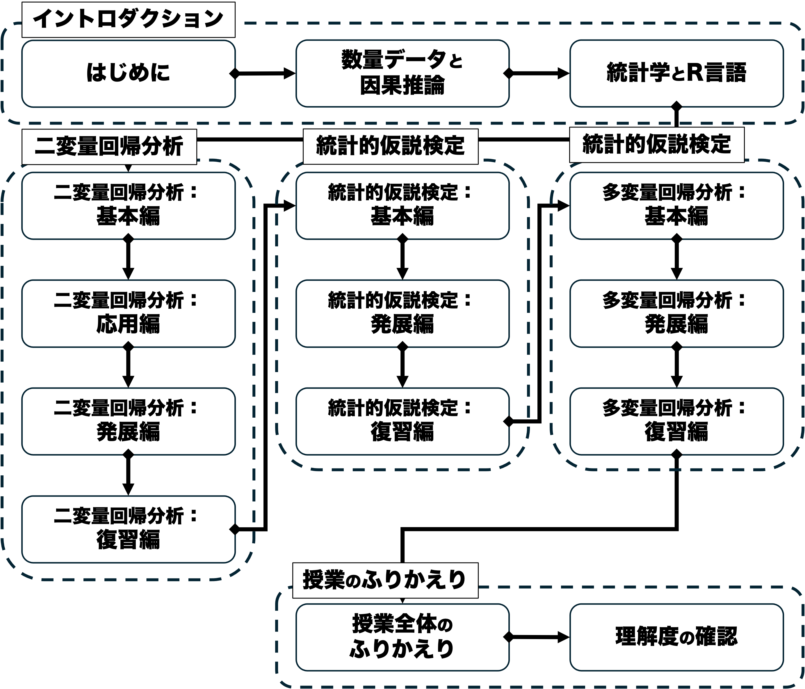

## 授業概要

現代における政治分析とは、選挙結果や民主化、国際紛争といったさまざまな**政治現象の原因をデータや証拠に基づいて探求**する営為に他なりません。この科目では、そのような**因果関係**の分析（＝**因果推論**）を行う能力を身につけることを目的としています。この「現代政治分析入門２」では、**数量的なデータの分析を通じて政治・社会現象にまつわる因果推論を行うにあたっての基礎**を築きます。本科目は、統計学の中でも特に重要な**回帰分析**に焦点を当て、関連する理論・概念・モデルを学びます。並行して統計分析用のプログラミング言語であるR言語の実習を行い、データを分析・解釈する経験を積みます。この過程の中で政治現象や社会現象を深く洞察する能力を養います。これらの過程で丁寧な予習復習と積極的な参加が求められますが、今後の職業生活にも活かせる知識と能力を得られることでしょう。

**キーワード：**因果推論、社会科学方法論、統計学、回帰分析、プログラミング、R言語

## 目的と到達目標

本科目では**数量的なデータの分析を通じて政治・社会現象にまつわる因果推論を行うにあたっての基礎**を築くことを目指します。本科目は法学部学位授与の方針**DP2（幅広い教養と専門知識）**および**DP3（課題解決力と表現力）**に特に強く関わります。

本科目の履修によって、具体的には以下の目標の達成が期待できます。

1. **因果関係を立証するための課題**と、それに対する**統計的アプローチ**を説明できる。【DP2】
1. **二変量回帰分析**の基本的な手順と関連する概念を説明できる。【DP2】
1. **統計的仮説検定**の基本的な手順と関連する概念を説明できる。【DP2】
1. **多変量回帰分析**の基本的な手順と関連する概念を説明できる。【DP2】
1. R言語上で回帰**分析を実装し、その結果を解釈**することができる。【DP3】

## 授業内容

| タイトル                      | 概要                                                                                                                                                                                                                                                                                                                                       | 授業外学習                                                                                                                                                                                       | 
| ---------------------------- | ------------------------------------------------------------------------------------------------------------------------------------------------------------------------------------------------------------------------------------------------------------------------------------------------------------------------------------------ | ------------------------------------------------------------------------------------------------------------------------------------------------------------------------------------------------ | 
| **01/はじめに**               | 本科目の目的・計画・評価方法・諸注意を紹介し、受講の可否の判断材料を提供する。受講動機やこの授業で学びたいことを共有し、今後学んでいくための環境を整える。                                                                                                                                                                                 | 【事前】シラバスを熟読し、興味があるトピックについて書き留めておく。【事後】配布資料やノートを見直し、到達目標が達成できているかチェックする。WebClass上の確認小テストを受験する。               | 
| **02/数量データと因果推論**   | 因果関係および数量データを用いた因果推論の枠組みを議論する。因果関係とはそもそも何かを定義したのち、データを使って因果推論するにあたっての難題として、ランダム性と内生性という概念を紹介する。ランダム化実験の強みと限界について理解する。                                                                                                 | 【事前】教科書（第1章）を読む。【事後】配布資料やノートを見直し、到達目標が達成できているかチェックする。WebClass上の確認小テストを受験する。WebClass上の確認小テストを受験する。                | 
| **03/統計学とR言語**          | （R実習回）統計学およびR言語の基本を紹介する。平均や分散・標準偏差など基本的な記述統計量を復習する。科学の条件としての再現可能性を議論し、再現性を確保するための方法を紹介する。データ分析用のプログラミング言語であるR言語を紹介し、自分で使ってみる。                                                                                    | 【事前】教科書（第2章）を読む。【事後】配布資料やノートを見直し、到達目標が達成できているかチェックする。WebClass上でのR実習課題に取り組む。                                                     | 
| **04/二変量回帰分析：基本編** | 回帰分析の最も基本的な形である二変量モデルを紹介する。基本となる統計モデルについて復習した後に、回帰分析によって回帰係数を推定し、その推定値を因果効果として解釈するための基本的な方法として、最小二乗法（OLS）を学ぶ。確率分布の基本を学んだ後、OLSで得られた因果効果の推定量のランダム性を議論する。さらに内生性が推定結果をどのように歪めるのかについても検討する。 | 【事前】教科書（第3章冒頭および3.1-3.3: pp.65-86）を読む。事前学習ビデオを視聴する。【事後】配布資料やノートを見直し、到達目標が達成できているかチェックする。WebClass上の確認小テストを受験する | 
| **05/二変量回帰分析：応用編** | 二変量回帰モデルについて深掘りする。標準誤差の概念を導入し、OLS推定の精度に影響する要因を議論する。その中でも特にサンプルサイズに焦点を当て、OLS推定値がもつ「一致性」という性質を紹介する。さらに、通常の標準誤差が適用できない条件についても議論する。                                                                                   | 【事前】教科書（第3章3.4-3.6: pp.86-98）を読む。【事後】配布資料やノートを見直し、到達目標が達成できているかチェックする。WebClass上の確認小テストを受験する。                                   | 
| **06/二変量回帰分析：発展編** | 二変量回帰モデルについてさらに深掘りする。回帰モデルがどれくらいデータを説明しているのかを示す概念である適合度について扱い、その尺度を紹介する。また外れ値とは何かについて学び、それが推定結果にどのような影響を与えるのかを議論する。                                                                                                     | 【事前】教科書（第3章3.7-3.8および結論: pp.86-98）を読む。【事後】配布資料やノートを見直し、到達目標が達成できているかチェックする。WebClass上の確認小テストを受験する。                         | 
| **07/二変量回帰分析：復習編** | （R実習回）二変量回帰分析について、これまで学んだことをふりかえるとともに、自分でR上で実装し、その結果を解釈してみる。                                                                                                                                                                                                                     | 【事前】教科書（第3章全て）を再読する。【事後】WebClass上でのR実習課題に取り組む。                                                                                                               | 
| **08/統計的仮説検定：基本編** | 統計的仮説検定の枠組みを学ぶ。仮説検定の基本的な手順を紹介し、帰無仮説や対立仮説、第1種／第2種の過誤など基本的な概念を習得する。続いてOLS推定値における仮説検定であるt検定の手順について学び、その中でも最も重要なp値という概念を理解する。                                                                                                | 【事前】教科書（第4章冒頭および4.1-4.3: pp.125-146）を読む。【事後】配布資料やノートを見直し、到達目標が達成できているかチェックする。WebClass上の確認小テストを受験する。                       | 
| **09/統計的仮説検定：発展編** | 統計的仮説検定について深掘りする。検出力という概念を紹介し、その重要性や第1種／第2種との過誤との関係を議論する。仮説検定の枠組みについて復習した後、その限界を議論する。さらに、仮説検定から派生した信頼区間という概念を紹介する。                                                                                                         | 【事前】教科書（第4章4.4-4.5: pp.146-161）を読む。【事後】配布資料やノートを見直し、到達目標が達成できているかチェックする。WebClass上の確認小テストを受験する。                                 | 
| **10/統計的仮説検定：復習編** | （R実習回）統計的仮説検定について、これまで学んだことをふりかえるとともに、自分でR上の分析結果を仮説検定の枠組みを用いて解釈してみる。                                                                                                                                                                                                     | 【事前】教科書（第4章全て）を再読する。【事後】WebClass上でのR実習課題に取り組む。                                                                                                               | 
| **11/多変量回帰分析：基本編** | 回帰分析のスタンダードである多変量モデルを紹介する。二変量モデルについて復習した後、多変量モデルが内生性の問題にどのように対処するのかを議論する。統制すべき変数を統制しない時に発生する欠落変数バイアスや、独立変数に測定誤差が含まれる場合の問題も合わせて検討する。                                                                     | 【事前】教科書（第5章冒頭および5.1-5.3: pp.169-192）を読む。【事後】配布資料やノートを見直し、到達目標が達成できているかチェックする。WebClass上の確認小テストを受験する。                       | 
| **12/多変量回帰分析：発展編** | 多変量モデルについて深掘りする。多変量モデルにおける係数の標準誤差の計算方法を紹介し、推定の精度に影響する要因を議論する。多変量モデルにおいて係数同士の大きさを比較する方法として変数の標準化という方法を導入する。複数の係数に関する仮説検定としてF検定を紹介する。                                                                      | 【事前】教科書（第5章5.4-5.6および結論: pp.192-219）を読む。【事後】配布資料やノートを見直し、到達目標が達成できているかチェックする。WebClass上の確認小テストを受験する。                       | 
| **13/多変量回帰分析：復習編** | （R実習回）多変量回帰分析について、これまで学んだことをふりかえるとともに、自分でR上で実装し、その結果を解釈してみる。                                                                                                                                                                                                                     | 【事前】教科書（第5章全て）を再読する。【事後】WebClass上でのR実習課題に取り組む。                                                                                                               | 
| **14/授業全体のふりかえり**   | これまで学んだことをふりかえり、理解度の確認に備える。                                                                                                                                                                                                                                                                                     | 【事前】これまでの授業内容を見直し、わからないことや気なる点を書き留めておく。【事後】これまでの配布資料やノートを見直し、各回の到達目標が達成できているかチェックする。                         | 
| **15/理解度の確認**           | 後期で学んだことの理解度を確認する。                                                                                                                                                                                                                                                                                                       | 【事前】これまでの配布資料やノートを見直し、各回の到達目標が達成できているかチェックする。                                                                                                       | 

### グラフィックシラバス

## 履修上の留意点

- 基本的には担当者が作成した資料に沿って、原則対面での講義を行います。ただし4回あるR実習回はオンラインで実施します。
- 授業資料等はWebClassで共有します。教場で配布は行いませんので、各自ダウンロードしてください。
- 本科目は事前学習や事後学習、さらにはPC上の実習も多く含んでおりますので、いわゆる「聞くだけ」の授業ではありません。また、積み上げ式の性格が強く、ほとんどの回は前回までの内容を前提に組まれています。授業をなるべく休まないこと、そして毎回の内容は十分時間をかけて復習するよう心がけてください。特にR（に限らずプログラミング言語全般）の習熟度は扱った時間に比例しますので、なるべく毎日自分のPCで「遊ぶ」ようにすると良いでしょう。
- 担当者と連絡したい際は、WebClassのメッセージ機能を使うか、初回にアナウンスするアドレスにメールを送付してください。
- メッセージやメールを送付する際には、初回にアナウンスするメールの書き方を遵守してください。守っていないメールには返信しないことがあります。
- 質問の際は適宜オフィスアワーもご利用ください。オフィスアワーと居室は初回にアナウンスします。
- オンラインでのR実習回は、スマートフォンやタブレットではなく、必ずデスクトップあるいはラップトップのPCで出席してください（Rの操作ができません）。本学では新入生向けにPCの購入支援制度がありますので、適宜利用してください~~（参考：https://www.komazawa-u.ac.jp/campuslife/scholarship/komazawa/byod/）~~。
- 因果推論の基本的な考え方を学ぶ科目として、同じ担当者による「現代政治分析入門１」が前期に開講されています。こちらの知識が前提になっている部分がありますので、合わせて履修を強く推奨します。

## 遠隔授業（オンライン授業）の実施回数

4回あるR実習回はオンラインで開催します。また、やむを得ない事情により、（R実習回を含めて）7回を上限にオンラインに振り替えることがあります。

## 評価

 - **平常点**（30%）…（到達目標1-4）ほぼ毎回、授業で学んだことを確認する小テストを行います。小テストはWebClass上で実施します。具体的には授業で学んだ統計学の理論・モデル・概念の習得を測る選択問題とします。
 - **R実習課題**（30%）…（到達目標5）全15回中4回をRの実習に充てますが、その各回でR実習課題を実施します。課題はWebClass上で選択式の小テスト形式で実施し、R上でのデータ分析および分析結果の解釈ができているかを評価します。
 - **期末試験**（40%）…（到達目標1-5）定期試験を実施します。選択式問題と記述式問題を組み合わせる予定です。授業で扱った因果推論や統計学上の概念の知識や、R上での分析結果の解釈ができているか評価します。具体的には各回授業で設定されている目標の到達度を測ります。

## 教科書

購入は必須ではありませんが、以下の教科書に基づいて授業を進めます。WebClassで該当部分を共有しますので、各回授業の事前学習として対応部分に目を通してきてください。

- ベイリー，マイケル（2025）『社会科学のための統計分析入門—リサーチにすぐ使える統計テクニック〈上〉』（加藤言人・西川賢監訳）勁草書房．
    - 社会科学で使われる統計分析手法の入門書。数学の前提知識がなくても読むことができ、かつStataやRによる実習も含んでいる。理論と実践のバランスがよく取れた好著。

以下は旧版のシラバスで購入必須としましたが、授業内容見直しのため必要なくなりました。ただしR実習の副読本として有用ですので、買って損はありません。買ってしまった方は自分で読み進めつつ、内容に沿ってRを動かしてください。授業の理解が深まります。

- ローデ，エレーナ&今井耕介（2025）『新・社会科学のためのデータ分析入門　導入編』（原田勝孝訳）岩波書店.
    - R言語を用いた社会科学データ分析の入門書の決定版。数学やプログラミングのバックグラウンドがない学生向けに書かれているので、非常にわかりやすい。
    

## 参考書

今科目を学習する上で参考になる図書としては以下の通りです。

- 今井耕介（2018）『社会科学のためのデータ分析入門［上・下］』岩波書店．
    - 実は旧教科書はこちらの本をわかりやすく圧縮したもの。こちらも前提知識なしで読める。本科目と並行して使用すると理解が深まる。
    
- 久米郁男（2025）『原因を推論する［新版］』有斐閣.
    - 社会科学方法論入門の決定版。学生のうちにぜひ読んでおきたい。
    
- 小島寛之（2006）『完全独習　統計学入門』ダイアモンド社．
    - 統計学の基本を1から学ぶのに最適。練習問題も多く、手を動かしながら学べる。
    
- 松林哲也（2021）『政治学と因果推論』岩波書店．
    - 政治学における統計的因果推論の入門書。因果関係の反実仮想アプローチや、具体的な手法（実験、回帰不連続、マッチング）を基本から学ぶのに最適。
    
- カニンガム，スコット（2023）『因果推論入門〜ミックステープ：基礎から現代的アプローチまで 』（加藤真大ほか訳）技術評論社．
    - 統計的因果推論の実践的な入門書。R上で回帰不連続デザインやマッチングを行う方法を学べる。上記松林（2021）の後に読むと良い。
    

## 学生による授業アンケート結果等による授業内容・方法の改善について

担当者は新任のため、前年度アンケートは実施されていません。今後行われるアンケート結果を踏まえ、必要に応じて改善していく予定です。

## アクティブラーニング型の授業科目

事前課題や授業中のワーク、事後課題やR実習などの形で、履修者の主体的参加を促すアクティブラーニングを積極的に行います。

## オープンな教育リソースの活用
- 宋財泫・矢内勇生（2020）『私たちのR－ベストプラクティスの探求』URL: [https://www.jaysong.net/RBook/](https://www.jaysong.net/RBook/)
    - R言語およびRStudioの実践ガイド。授業でも用いることがあるが、Rを自学自習する際に役立ててほしい。
