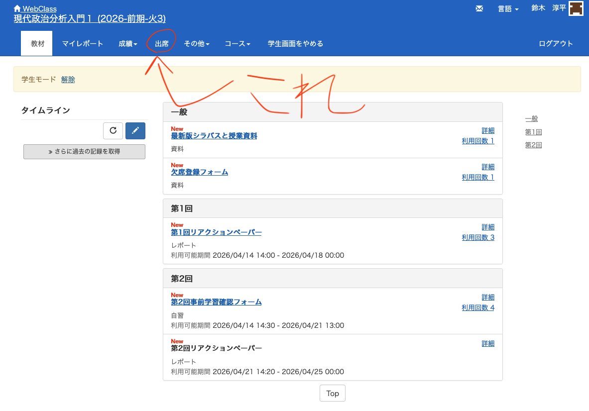
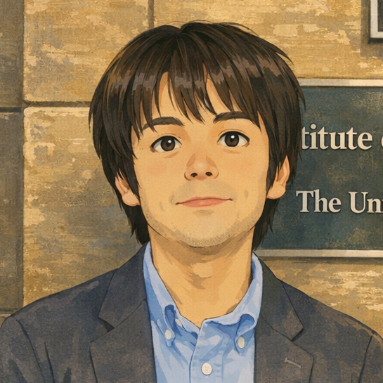
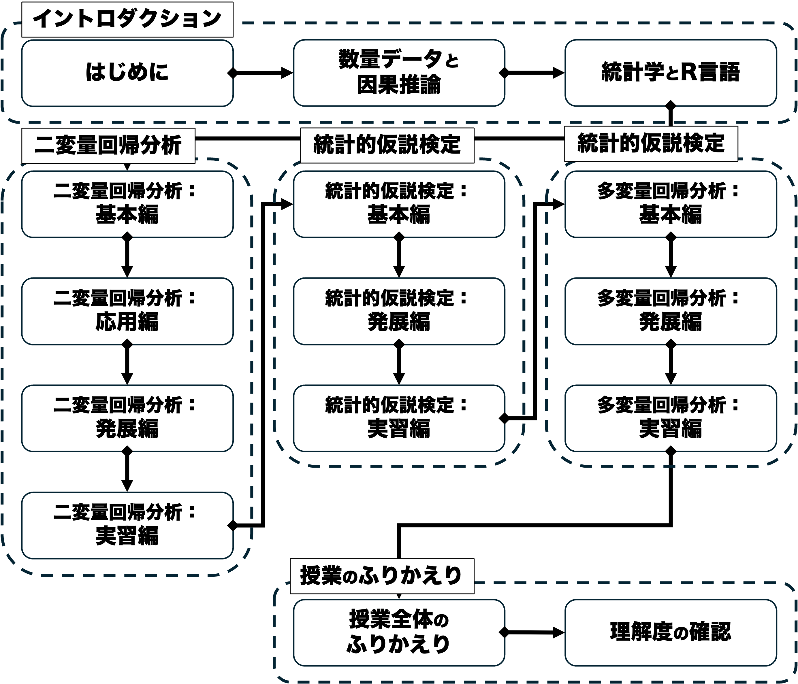



## 出席登録をお願いします


## 今日の目次

1. はじめに
1. 授業概要
1. 諸注意と評価
1. アイスブレイク
1. 授業で学ぶこと
1. まとめ

# はじめに
::: {.notes}
目標15分
:::
## 授業資料と最新版シラバス
{.r-stretch}

::: {.notes}
後述もするが、目的は変えていないものの、履修者数や前期の反省などを踏まえて授業計画は大きく変わっている。KONECOのシラバスではなくこちらを参照されたい。
:::

## 本日の目的と到達目標
#### 目的
本科目の目的・計画・評価方法・諸注意を紹介し、受講の可否の判断材料を提供する。受講動機やこの授業で学びたいことを共有し、今後学んでいくための環境を整える。

::: {.fragment .fade-in}
#### 到達目標
1. 本科目「現代政治分析入門2」の目的、進め方、評価方法を他人に説明できる。
1. 自分の興味関心を言語化し、本科目で学びたいことを他人に説明できる。
1. 本科目「現代政治分析入門2」で具体的に学ぶことを他人に説明できる。
:::

## 担当者の自己紹介
::: {.columns}
::: {.column width=25%}


 - [[email]{.button}](mailto:jsuzuki@iss.u-tokyo.ac.jp)
 - [[webpage]{.button}](https://junpei-suzuki.github.io)
 - [[researchmap]{.button}](https://researchmap.jp/junpeisuzuki-ps)
 - [[Podcast]{.button}](https://open.spotify.com/episode/5EmfMuzgwuTSLuMblepmTp?si=_d_BnbJ-QSOIBMeldISyVg)
 
:::

::: {.column width=5%}
:::

::: {.column width=70%}
::: {.fragment .fade-in}
**鈴木淳平**（すずき・じゅんぺい）

駒澤大学法学部政治学科講師
:::

::: {.incremental}
 - 学位：早稲田大学博士（政治学）（2024年）
 - 職歴：早稲田大学助手→東京大学特任研究員→駒澤大学講師
 - 専門：先進諸国の比較政治経済学
 - 居室：第二研究館2825室

:::

:::

:::

::: {.notes}
バレーボール担当の鈴木淳平先生とは別人です。
:::

## アンケート
鈴木担当の前期科目「[現代政治分析入門1](https://junpei-suzuki.github.io/ICPA1-2026-Komazawa/)」を履修していましたか？

1. していた
1. していなかった

[WebClassアンケート](https://webclass.komazawa-u.ac.jp/webclass/login.php?id=1eaaee58c7fb1905080f7cc215e0d345&page=1)で回答

{.r-stretch}

# 授業概要
::: {.notes}
ここまで15分

目標10分
:::
## 授業概要
::: {.incremental}
 - 現代の政治分析＝さまざまな**政治現象の原因をデータや証拠に基づいて探究**
 - **数量的なデータの分析を通じて政治・社会現象にまつわる因果推論を行うにあたっての基礎**を身につける
 - 統計学の中でも特に重要な**回帰分析**を学ぶ
 - **講義方式**によるが、**R言語**の実習を通じてデータ分析を実践的に学習

:::

::: {.notes}
現代の政治分析のうちデータ分析にフォーカスすること自体は変わっていない。しかし履修者数が多いこと、TAもつけられないことに鑑み、Rの実習の比重を下げ講義を重点的にした。ただし講義だけでも面白くはないので、R実習もして、データ分析を実践することの面白さも味わってもらう。
:::

## 到達目標
::: {.incremental}

1. **因果関係を立証するための課題**と、それに対する**統計的アプローチ**を説明できる。
1. **二変量回帰分析**の基本的な手順と関連する概念を説明できる。
1. **統計的仮説検定**の基本的な手順と関連する概念を説明できる。
1. **多変量回帰分析**の基本的な手順と関連する概念を説明できる。
1. **R言語上で回帰分析を実装し、その結果を解釈**することができる。

:::

::: {.notes}
大目的は変えないまでも、到達目標は変えた。特に回帰分析にフォーカスしてその密度を上げた。
:::

## 進行計画
{.r-stretch}

::: {.notes}
授業進行計画

- 大きなトピックとしては二変量回帰分析、統計的仮説検定、多変量回帰分析の3つ
- それぞれ2-3回分対面で講義し、復習を兼ねてRで実装してみる回も設ける（オンライン開催）。
- 最後の1回分は対面講義で授業全体の見直しを行う。
- 最後は理解度の確認→レポートではなくテスト

:::

# 諸注意と評価
::: {.notes}
ここまで25分

目標20分
:::
## 授業の進め方
::: {.incremental}
 - 基本的は対面の講義方式で、スライドを使用
    - 4回あるR実習回はオンラインで実施
 - 授業資料等はWebClassや[授業サイト](https://junpei-suzuki.github.io/ICPA2-2026-Komazawa/)で共有
    - スライドのハードコピーは配布はしない予定なので、各自でダウンロードすること
 - 随時アクティブラーニングも取り入れ、「聞くだけ」の授業にはしない
    - 事前・事後学習、PC上の実習⋯
 - 「積み上げ式」の性格が強い
    - ほとんどの回は前回までの内容が前提
    - なるべく休まないことが重要
       - 休んだら自分で資料を見て、不明点は友人or教員に質問
 
:::

## 事前・事後学習
::: {.fragment .fade-in}
#### 事前学習
::: {.incremental}
 - 指定された教科書等の該当部分を読む→授業開始までにWebClass上のチェックフォームに記入
 - **【教科書】**ベイリー，マイケル（2025）『[社会科学のための統計分析入門—リサーチにすぐ使える統計テクニック〈上〉](https://amzn.asia/d/07M5xkm1)』（加藤言人・西川賢監訳）勁草書房．
     - 当初のシラバスとは異なる→[WebClassで共有](https://webclass.komazawa-u.ac.jp/webclass/login.php?id=e812cae609a4874c77b89138aa811bf0&page=1)

:::
:::

::: {.fragment .fade-in}
#### 事後学習
::: {.incremental}
 - 授業の**3日後（金曜日）**を締切として、WebClass上で確認小テストを実施
     - 次回授業でフィードバック予定

:::
:::

## 連絡方法とオフィスアワー
::: {.incremental}
 - コンタクトは担当者の[アドレス](mailto:jsuzuki@komazawa-u.ac.jp)ににメールするか、WebClassのメッセージ機能を使う
 - メールを送付する際は「[メールの書き方](http://www2.ipcku.kansai-u.ac.jp/~iwamoto/email.pdf)」を必ず参照し、形式やマナーを守ること
 - オフィスアワー（OH）：**木曜日4限　2研2825室** 
    - **OH中はアポなしで来室可能**
    - これ以外でもアポにより対応可能

:::

## WebClass上の出席登録
::: {.incremental}
- 毎回WebClass上で出席登録を実施
   - 開始後20分まで→出席
   - 開始後20-40分→遅刻
   - 開始後40分以降→欠席
- 出席回数自体は成績に含まない
   - 重要なのは確認小テストとR実習課題
- 忘れた場合の変更には応じない

:::

## その他注意
::: {.incremental}
 - オンラインのR実習回では必ずパソコンで参加すること
 - 授業計画は当初のシラバスから大幅に変更されている
    - さらに若干の変更の可能性あり
 - やむを得ない事情（病気、就活、忌引き等）で欠席する際にはWebClass上からアクセスできるフォームから登録
 - [WebClassで質問用掲示板](https://webclass.komazawa-u.ac.jp/webclass/login.php?id=8534fce0d365a4c344f61c6ff7a7a0cc)を用意してあるので、積極的に活用すること
    - 受講生同士で教え合っても良い

:::

---

::: {.incremental}
- 授業を通じて数式もそれなりに出てくる
   - 予備知識としてはあまり必要ではない（1次関数くらい）
      - **数学の授業ではない**ので厳密な証明もしない
      - 面倒な手計算もしない→Rにやらせる方法を学ぶ
   - しかし数式の意味や計算の仕組みは覚えておいてほしい
      - わかりやすく説明します

:::

## 評価 {.smaller}
::: {.fragment .fade-in}
**平常点**（30%）⋯確認小テスト

- WebClass上で**選択式**
- 授業で学んだ統計学の理論・モデル・概念の習得を評価
- 回答時には授業資料の**参照可能**

:::

::: {.fragment .fade-in}
**R実習課題**（30%）⋯4回の実習後の課題

- WebClass上で**選択式**
- R上での**データ分析および分析結果の解釈**ができているかを評価
- 回答時には授業資料の**参照可能**

:::

::: {.fragment .fade-in}
**期末試験**（40%）⋯選択式問題と記述式問題を組み合わせた筆記試験

 - 授業で扱った**因果推論や統計学上の概念の知識**
 - R上での**分析結果の解釈**
 - 授業資料・教科書の**持込可**の予定

:::

::: {.notes}

:::


# アイスブレイク
::: {.notes}
ここまで45分

休憩5分

目標15分
:::

## 質問
目的：自分の受講動機を整理し、本科目で学ぶことを意識する

::: {.fragment .fade-in}
1. なぜこの授業を受講しようと思ったのか、理由を[チャット](https://webclass.komazawa-u.ac.jp/webclass/login.php?id=61c6d1b524cede4ce7fa0180ce353079)に自由に書き込んでください。
1. 改訂版のシラバスを読み、興味を持ったトピックやワードを[チャット](https://webclass.komazawa-u.ac.jp/webclass/login.php?id=61c6d1b524cede4ce7fa0180ce353079)に自由に書き込んでください。

{width=30%}

:::


# 本授業で学ぶこと
::: {.notes}
ここまで65分（1:05:00）

目標15分
:::

## 質問
因果関係の条件とはなんでしょうか。

- 前期の入門1を履修した方は、覚えている範囲で答えてみてください。
- 履修していなかった方は自分なりに考えてみてください。

[チャット](https://webclass.komazawa-u.ac.jp/webclass/login.php?id=61c6d1b524cede4ce7fa0180ce353079)で回答

{width=30%}

## 例：洋画視聴とTOEICの点数
```{r toeic-prep}
#| include: false
dt_toeic <- tibble(
  x        = rnorm(100, mean = 4, sd = 1),
  y        = 600 + 20 * x + rnorm(100, mean = 0, sd = 10),
)
```

::: {.r-stack}

::: {.fragment}
```{r toeic-1}
dt_toeic %>% 
  ggplot(aes(x = x, y = y)) +
  geom_point() +
  labs(x = "洋画の視聴時間（時間/週）",
       y = "TOEICの点数")
```

:::

::: {.fragment}
```{r toeic-2}
dt_toeic %>% 
  ggplot(aes(x = x, y = y)) +
  geom_point() +
  geom_smooth(method = "lm",
              se = FALSE) +
  labs(x = "洋画の視聴時間（時間/週）",
       y = "TOEICの点数")
```

:::
:::

::: {.fragment .fade-in}
$TOEIC点数=\beta_{0}+\beta_{1}洋画視聴時間$

::: {.incremental}
- $\beta_{0}$と$\beta_{1}$はそれぞれ何か？→**回帰分析**

:::
:::

::: {.notes}
駒大生全体からランダムに集めた100人の洋画の週あたり視聴時間とTOEICの点数の散布図

- 点一つ一つが学生の視聴時間と点数
- 回帰分析を用いて直線→傾きが因果効果の推定結果

:::

## 回帰分析の課題
::: {.incremental}
1. $\beta_{0}$と$\beta_{1}$はどう計算（推定）するか？
   - 二変量回帰分析で学ぶ**最小二乗法**（OLS）
   - 実際には**R**で推定
1. $\beta_{1}$の値は意味があるのか？
   - $\beta_{1}=20$という推定結果
      - 偶然その値になっただけではないか？
   - **統計的仮説検定**の枠組みで判別
1. $\beta_{1}$は因果効果として解釈できるのか？
   - **内生性**の問題→ただの共変関係？
      - Cf. 現代政治分析入門1での3条件

:::

# まとめ
::: {.notes}
ここまで80分（1:20:00）

目標10分
:::

## 本日の目的と到達目標
#### 目的
本科目の目的・計画・評価方法・諸注意を紹介し、受講の可否の判断材料を提供する。受講動機やこの授業で学びたいことを共有し、今後学んでいくための環境を整える。

::: {.fragment .fade-in}
#### 到達目標
1. 本科目「現代政治分析入門2」の目的、進め方、評価方法を他人に説明できる。
1. 自分の興味関心を言語化し、本科目で学びたいことを他人に説明できる。
1. 本科目「現代政治分析入門2」で具体的に学ぶことを他人に説明できる。
:::

## 次回までに

::: {.fragment .fade-in}
#### 事後学習

 - 授業資料を見直し、目標到達をセルフチェック
 - WebClass上での確認小テスト（金曜日まで）
    - 今回は動作確認も兼ねているので成績には含まない

:::

::: {.fragment .fade-in}
#### 事前学習

 - 教科書（1章）を読み、WebClass上でのチェックフォーム記入

:::