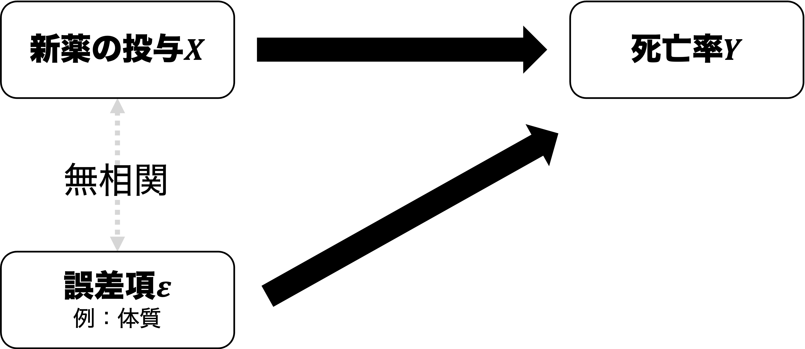



## 出席登録をお願いします


## 今日の目次

1. はじめに
1. 因果関係
1. モデルの特定化
1. ランダム性と内生性
1. ランダム化実験
1. まとめ

# はじめに
## 本日の目的と到達目標
#### 目的
因果関係およびデータを用いた因果推論の枠組みを議論する。因果関係とはそもそも何かを定義したのち、データを使って因果推論するにあたっての難題として、ランダム性と内生性という概念を紹介する。ランダム化実験の強みと限界について理解する。

::: {.fragment .fade-in}
#### 到達目標
1. 因果関係と相関関係の違いを説明できる。
基本となる統計モデル（$Y_i=\beta_0+\beta_{1}X_{i}+\varepsilon_i$）の各項を説明できる。
1. 標本抽出のランダム性がなぜ因果推論を困難にするのかを説明できる。
1. 内生性がなぜ因果推論を困難にするのかを説明できる。
1. ランダム化実験がなぜ外生性を実現するのかを説明できる。
1. ランダム化実験の3つの限界を列挙できる。
:::

## 小テストの講評
TBD

# 因果関係
## 因果関係 (causality)
**原因**と**結果**の関係

::: {.incremental}
- 原因＝独立変数
- 結果＝従属変数

:::

::: {.fragment .fade-in}
#### 因果関係の3条件（入門1より）
::: {.incremental}
1. 共変関係
1. 他の変数の統制
1. 原因の時間的先行

:::
:::

::: {.fragment .fade-in}
→**内生性**という概念で捉え直す
:::

## 質問
例：洋画視聴とTOEICの点数

::: {.fragment .fade-in}
```{r toeic}
dt_toeic <- tibble(
  x        = rnorm(100, mean = 4, sd = 1),
  y        = 600 + 20 * x + rnorm(100, mean = 0, sd = 10),
)

dt_toeic %>% 
  ggplot(aes(x = x, y = y)) +
  geom_point() +
  geom_smooth(method = "lm",
              se = FALSE) +
  labs(x = "洋画の視聴時間（時間/週）",
       y = "TOEICの点数")
```
:::

::: {.fragment .fade-in}
「洋画視聴をすればTOEICの点数が伸びる」と言えるか？
:::

::: {.notes}
例：洋画視聴時間とTOEICの点数の関係

- 洋画視聴時間以外にTOEICの点数に影響する要因がありそう
- 英語が得意でTOIECの点数が高いから洋画をよく視聴する可能性も
- →右肩上がりの関係を額面通りには受け取ることはできない

:::

# モデルの特定化
## モデルの特定化 (model specification)
変数同士の関係を数式で表すこと

::: {.fragment .fade-in}
例：ドーナツを食べると体重は増えるか？

::: {.incremental}
- 原因：食べたドーナツ量→結果：体重
- アメリカ人からランダムに選ばれた13人のデータを分析して検証
   - **名前**（name）：各個人の名前
   - **ドーナツ**（donuts）：1週間で食べるドーナツ（個数）
   - **体重**（weight）：体重（kg）

:::
:::

## データと散布図 {.smaller}
::: {.panel-tabset}
#### データ
```{r donut-dt}
load("data/Ch1_ChapterExample_Donuts.RData")

donut_dt <- tibble(
  id = 1:length(name),
  name = name,
  donuts = round(donuts, digits = 0),
  weight = round(weight / 2.205, digits = 1)
)

donut_dt |> 
  knitr::kable()

```

#### 散布図①
```{r donut-scat1}
donut_dt |> 
  ggplot(aes(x = donuts,
             y = weight)) +
  geom_point() +
  geom_label_repel(aes(label = name)) +
  labs(x = "ドーナツ（個／週）",
       y = "体重（kg）")
```

#### モデル
ここで以下のようなモデルを特定化：

::: {.fragment .fade-in}
$$
体重_{i} = \beta_{0} + \beta_{1} ドーナツ_{i} + \varepsilon_{i}
$$

:::

::: {.fragment .fade-in}
- $体重_{i}$：$i$番目の人の体重（kg）
- $ドーナツ_{i}$：i番目の人が1週間で食べるドーナツ（個）
- $\beta_{1}$（回帰係数）：ドーナツを1個食べるごとに体重が何kg増えるか
- $\beta_{0}$（定数）：ドーナツを食べないときの体重
- $\varepsilon_{i}$（誤差項）：ドーナツでは説明しきれない体重の変動
   - 例：性別、身長、運動習慣…

:::

#### 散布図②
```{r donut-scat2}
donut_dt |> 
  ggplot(aes(x = donuts,
             y = weight)) +
  geom_point() +
  geom_smooth(se = FALSE,
              method = "lm") +
  labs(x = "ドーナツ（個／週）",
       y = "体重（kg）")
```

::: {.fragment .fade-in}
→モデル$体重_{i} = \beta_{0} + \beta_{1} ドーナツ_{i} + \varepsilon_{i}$は直線を表す数式

:::

:::

## 一般的な基本モデル
$$
Y_{i} = \beta_{0} + \beta_{1} X_{i} + \varepsilon_{i}
$$

::: {.incremental}
- **$\beta_{1}$（回帰係数）：**$X$（独立変数）が1増えた時に$Y$（従属変数）がどれだけ増えるか
   - 散布図上では直線の**傾き**
- **$\beta_{0}$（定数）：**$X$が0のときの$Y$の値
   - 散布図上では直線の**切片**
      - Y軸との交点のY座標
   - これ自体は重要でない
- **$\varepsilon_{i}$（誤差項）：**$X$では説明しきれない$Y$の変動
   - データにない→観測不能
   - 散布図上では直線と各点のずれ

:::

::: {.notes}
この例では、$\beta_{0}=55.62$、$\beta_{1}=4.13$
:::

## クイズ
以下4つのグラフを見て、$\beta_{0}$と$\beta_{1}$とがそれぞれ0より大きいか、等しいか、小さいかを判断してください。

::: {.panel-tabset}
#### 図(a)
```{r scatter-a}
scatter_a_dta <- tibble(
    x        = runif(200, min = 0, max = 1),
    y        = 0.4 + 0.6 * x + rnorm(200, mean = 0, sd = 0.1)
)

scatter_a_dta |> 
  ggplot(aes(x = x,
             y = y)) +
  geom_point() +
  geom_smooth(se = FALSE,
              method = "lm") +
  labs(x = "X",
       y = "Y")
  
```

#### 図(b)
```{r scatter-b}
scatter_b_dta <- tibble(
    x        = runif(200, min = 0, max = 1),
    y        = 0.8 - 0.6 * x + rnorm(200, mean = 0, sd = 0.1)
)

scatter_b_dta |> 
  ggplot(aes(x = x,
             y = y)) +
  geom_point() +
  geom_smooth(se = FALSE,
              method = "lm") +
  labs(x = "X",
       y = "Y")
  
```

#### 図(c)
```{r scatter-c}
scatter_c_dta <- tibble(
    x        = runif(200, min = 0, max = 1),
    y        = 0.4 - 0 * x + rnorm(200, mean = 0, sd = 0.1)
)

scatter_c_dta |> 
  ggplot(aes(x = x,
             y = y)) +
  geom_point() +
  geom_smooth(se = FALSE,
              method = "lm") +
  labs(x = "X",
       y = "Y")
  
```

#### 図(d)
```{r scatter-d}
scatter_d_dta <- tibble(
    x        = runif(200, min = -6, max = 6),
    y        = 2 + 1 * x + rnorm(200, mean = 0, sd = 1)
)

scatter_d_dta |> 
  ggplot(aes(x = x,
             y = y)) +
  geom_point() +
  geom_smooth(se = FALSE,
              method = "lm") +
  labs(x = "X",
       y = "Y")
  
```


:::

# ランダム性と内生性
## 因果推論の課題
回帰係数$\beta_{1}$を計算できても直ちに因果効果だとは解釈できない。なぜなら…

::: {.incremental}
1. 標本のランダム性
1. 内生性

:::

## 標本のランダム性
データは**ランダムサンプリング**

- **母集団**の一部をランダムに抽出して**標本**とすること

::: {.fragment .fade-in}
例：ドーナツと体重

::: {.incremental}
- $\beta_{1}=4.13$→たまたまそうなっただけ？
   - 本当はドーナツを食べても太らないかも（母集団で$\beta_{1}=0$）
   - 本当はドーナツはもっと太るかも（母集団で例えば$\beta_{1}=10$）

:::
:::

## 内生性（endogeneity）
誤差項が独立変数と**相関関係**にあること

```{r col-prep}
#| include: false
NN <- 200
x1 <- runif(NN)
x2.temp <- runif(NN)
Corr1 <- 0.70
Corr2 <- -0.70

cor_dta <- tibble(x1 = x1,
                  x2 = 0.95 * (x1 * Corr1 + x2.temp * sqrt(1 - Corr1 ^ 2)) - 0.1,
                  x3 = x2.temp * 1.2,
                  x4 = x1 * Corr2 + x2.temp * sqrt(1 - Corr2^2) + 0.6)


```

::: {.fragment .fade-in}
相関関係＝共変関係：一方の変数の変化が他の変数の変化と連動すること

:::

::: {.fragment .fade-in}
```{r corr}
#| layout-ncol: 3
#| fig-cap: 
#|    - "正の相関"
#|    - "無相関"
#|    - "負の相関"
#| fig-width: 3
#| fig-length: 4

cor_dta |> 
  ggplot(aes(x = x1, y = x2)) +
  geom_point() +
  labs(x = "独立変数", y = "誤差項")

cor_dta |> 
  ggplot(aes(x = x1, y = x3)) +
  geom_point() +
  labs(x = "独立変数", y = "誤差項")

cor_dta |> 
  ggplot(aes(x = x1, y = x4)) +
  geom_point() +
  labs(x = "独立変数", y = "誤差項")


```

:::

## 内生性の図解
{.r-stretch}


## 例：ドーナツと体重
{width=80%}

::: {.notes}
例：ドーナツと体重

- 誤差項の中に身長が含まれるとする
   - 今回はデータに含まれていない→観測不可能
- 身長が高いと体重は増えるという因果
- 身長が高いとドーナツを多く食べるという相関
   - カロリー消費が多いから？
- 結果、ドーナツと体重に正の相関
   - 純粋な因果効果と区別ができない

:::

# ランダム化実験
## ランダム化比較試験
#### Randomized Controlled Trial: RCT
研究対象者をランダムにグループ分けし、治療法や介入などの効果を検証する方法

::: {.fragment .fade-in}
例：新薬の治験


::: {.incremental}
- 被験者をくじ引きでランダムに**統制群**と**処置群**に分割
- 統制群にはプラセボ（偽薬）、処置群には本物の薬を投与
- 二群間で死亡率を比較

:::
:::

## 外生性（exogeneity）
誤差項が独立変数と**相関していない**こと

::: {.fragment .fade-in}
{width=100%}
:::

## RCTの限界
::: {.incremental}
1. 実施上の問題
    - 例：サーベイ実験→数十万-数百万円（**金銭的コスト**）
    - 例：ドーナツ摂取のランダム化（**非遵守**）
    - 例：民主化と経済成長（**理論的に無理**）
1. 倫理上の問題
    - 例：タバコとガンの発症率を調べるRCT
1. 外的妥当性の問題
    - **内的妥当性**は高い→因果効果の厳密な推定
    - **外的妥当性**は低い→実験結果を他の文脈に適用できるか？

:::

# まとめ
## 本日の目的と到達目標
#### 目的
因果関係およびデータを用いた因果推論の枠組みを議論する。因果関係とはそもそも何かを定義したのち、データを使って因果推論するにあたっての難題として、ランダム性と内生性という概念を紹介する。ランダム化実験の強みと限界について理解する。

::: {.fragment .fade-in}
#### 到達目標
1. 因果関係と相関関係の違いを説明できる。
基本となる統計モデル（$Y_i=\beta_0+\beta_{1}X_{i}+\varepsilon_i$）の各項を説明できる。
1. 標本抽出のランダム性がなぜ因果推論を困難にするのかを説明できる。
1. 内生性がなぜ因果推論を困難にするのかを説明できる。
1. ランダム化実験がなぜ外生性を実現するのかを説明できる。
1. ランダム化実験の3つの限界を列挙できる。
:::

## 次回までに

::: {.fragment .fade-in}
#### 事後学習

 - 授業資料を見直し、目標到達をセルフチェック
 - WebClass上での確認小テスト（金曜日まで）

:::

::: {.fragment .fade-in}
#### 事前学習

 - 教科書（2章）を読み、WebClass上でのチェックフォーム記入
 - 事前学習ビデオを視聴し、Posit Cloudの初期設定を完了をしておく
 
:::

::: {.fragment .fade-in}
来週はオンラインによるR実習です。**必ずPCで受講**してください。

:::
