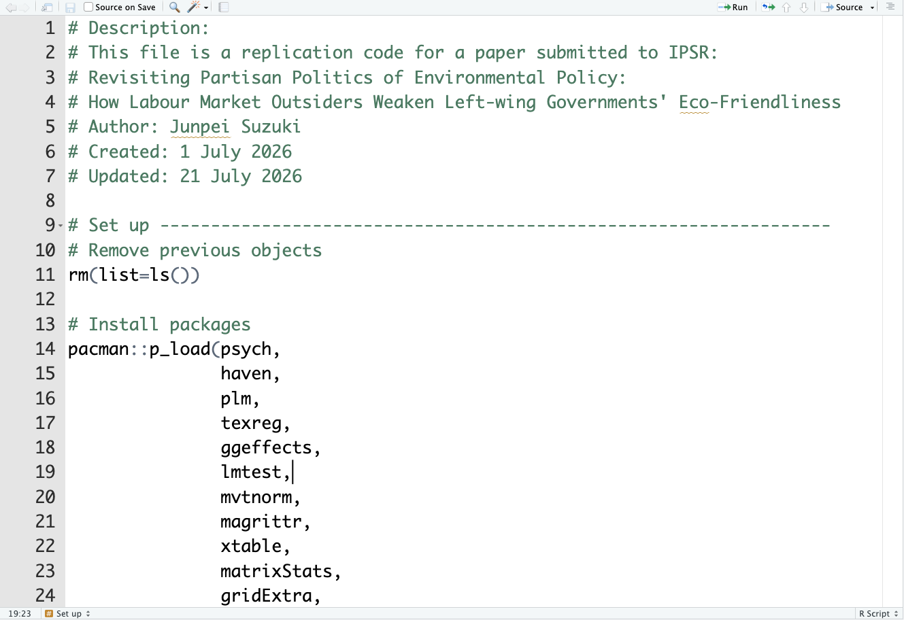
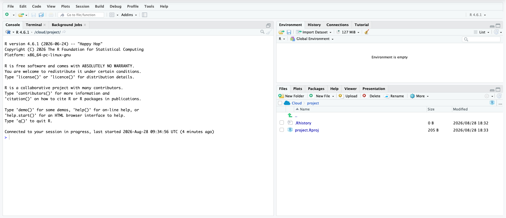
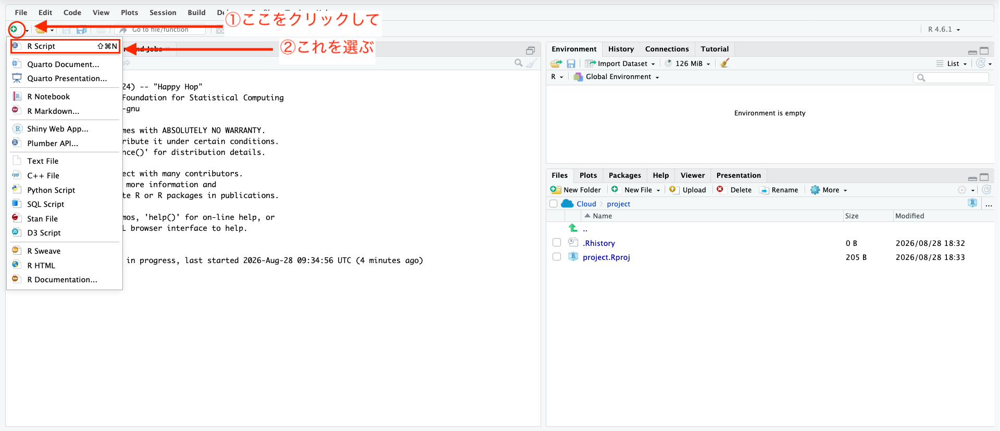
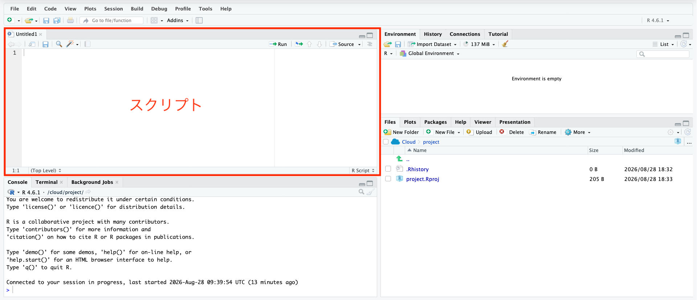
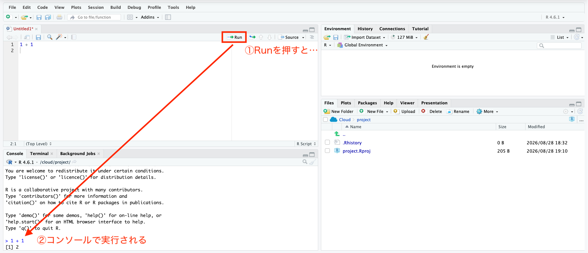
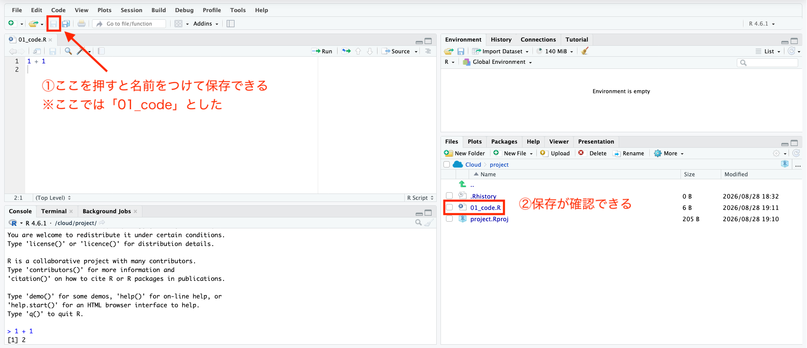
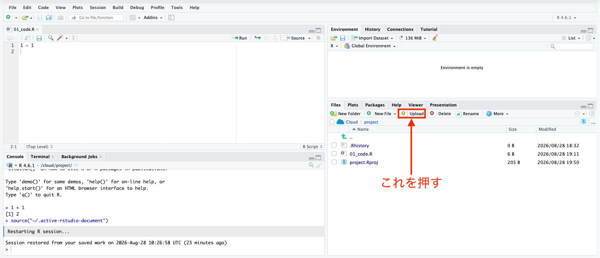
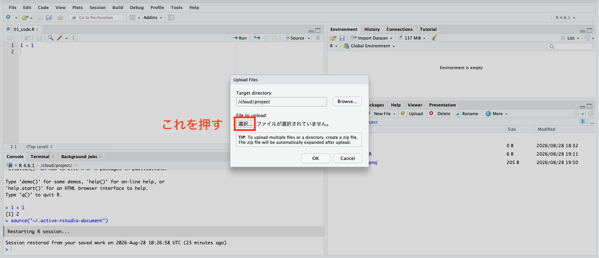
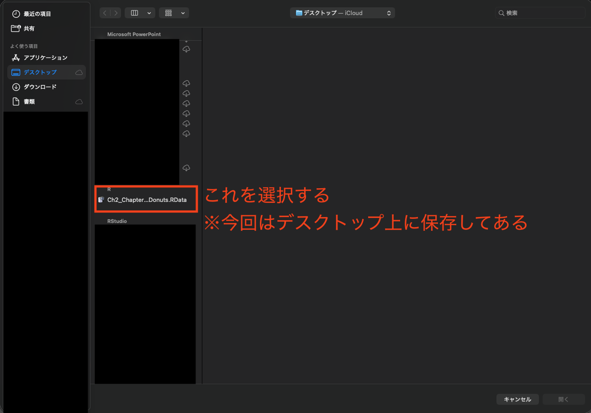
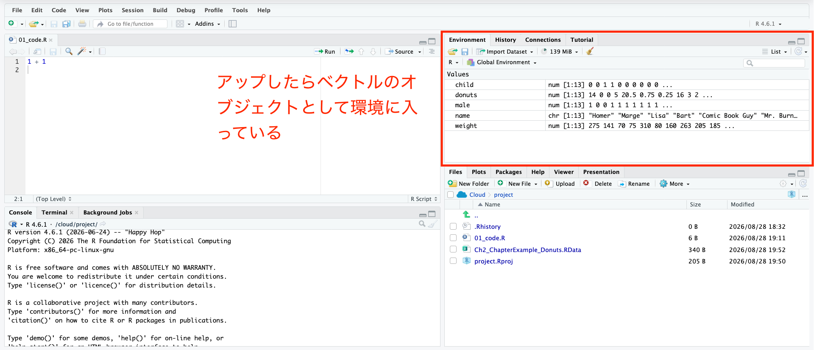



## 出席登録をお願いします


## 今日の目次

1. はじめに
1. 記述統計
1. 再現可能性
1. RとRStudio
1. 実習：Rの基本操作
1. まとめ

# はじめに
## 本日の目的と到達目標
#### 目的
統計学およびR言語の基本を紹介する。平均や分散・標準偏差など基本的な記述統計量を復習する。科学の条件としての再現可能性を議論し、再現性を確保するための方法を紹介する。データ分析用のプログラミング言語であるR言語を紹介し、自分で使ってみる。

::: {.fragment .fade-in}
#### 到達目標
1. 5つの記述統計量（観察数、平均値、標準偏差、最小値、最大値）をそれぞれ説明できる。
1. 研究再現用ファイルの2つの構成要素を列挙できる。
1. RおよびRStudioとは何かを説明できる
1. Rを使って実際のデータの記述統計とグラフによる要約を作り、解釈できる。

:::

## 小テストの講評
TBD

# 記述統計
## 記述統計と散布図
手元にあるデータの特徴をわかりやすく整理し、要約して表現すること

::: {.fragment .fade-in}
データを手に入れたら、まず以下を計算

::: {.incremental}
- **観察数**（$n$）…データがいくつあるか
- **平均**…合計を観察で割った値
- **標準偏差**…データの散らばり具合を表す尺度
- **最小値**、**最大値**

:::
:::

::: {.fragment .fade-in}
加えて、散布図を作る（＝**プロット**する）

::: {.incremental}
- 関係性の把握と外れ値の発見

:::
:::

## 平均と最小値
$n$個のデータ$X= \{ x_1, x_2, \cdots, x_n \}$があるとする。

::: {.fragment .fade-in}
#### 平均 (mean)
合計を観察で割った値
$$
\overline{X} = \frac{\sum_{i=1}^{n} x_i}{n}
$$

:::

::: {.fragment .fade-in}
#### 標準偏差 (standard deviation: SD)
データの散らばり具合を表す尺度

$$
SD = \sqrt{\frac{\sum{(x_i - \overline{X}})^2}{n}}
$$

:::

## 平均と最小値の計算
6人の駒大生が10点満点のテストを受け、その結果のデータは$X = \{ 5, 6, 6, 8, 4, 9 \}$になりました。

::: {.fragment .fade-in}
平均$\overline{X}$を求めると…
$$
\overline{X} = \frac{5 + 6 + 6 + 8 + 4 + 9}{6} = \frac{38}{6} = 6.33...
$$

:::

::: {.fragment .fade-in}
標準偏差を求めると…

::: {style="font-size: 60%;"}
$$
\sqrt{\frac{(5 - \overline{X})^2 + (6 - \overline{X})^2 + (6 - \overline{X})^2 + (8 - \overline{X})^2 + (4 - \overline{X})^2 + (9 - \overline{X})^2}{6}} = 1.70...
$$
:::
:::

## 例：ドーナツと体重
::: {.fragment .fade-in}
```{r donut-dt}
load("data/Ch1_ChapterExample_Donuts.RData")

donut_dt <- tibble(
  id = 1:length(name),
  name = name,
  male = male,
  donuts = donuts,
  weight = weight / 2.205
)
```
:::

::: {.fragment .fade-in}
``` {r donut-desc}
weight_desc <- donut_dt |> 
  summarise(変数 = "体重",
            観察数 = length(na.omit(weight)),
            平均 = mean(weight),
            標準偏差 = sd(weight),
            最小値 = min(weight),
            最大値 = max(weight))

donut_desc <- donut_dt |> 
  summarise(変数 = "ドーナツ",
            観察数 = length(na.omit(donuts)),
            平均 = mean(donuts),
            標準偏差 = sd(donuts),
            最小値 = min(donuts),
            最大値 = max(donuts))

rbind(weight_desc, donut_desc) |> 
  knitr::kable(digits = 1)

```

:::

::: {.fragment .fade-in}
```{r donut-scat1}
donut_dt |> 
  ggplot(aes(x = donuts,
             y = weight)) +
  geom_point() +
  labs(x = "ドーナツ（個／週）",
       y = "体重（kg）")
```

:::

# 再現可能性
## 再現可能性（replicability）
同じ手順を踏めば、他人でも同様の結果や結論を得られること

::: {.fragment .fade-in}
例：

](http://toyokeizai.net/mwimgs/0/d/-/img_0d828f5e7d75780cc71f369bee0b641050504.jpg)

:::

::: {.notes}
STAP細胞と再現可能性

- STAP細胞…どんな臓器にもなれる夢の細胞
- 小保方氏はSTAP細胞の存在と作り方を提唱→誰も再現できず

:::

## 研究再現用ファイル (replication file)
他人が研究結果を再現するために必要なファイル

- **コードブック**…データを文書化したもの
   - データソース、変数の定義など
- **分析用コード**…分析結果を出力するためのプログラミングコマンド

## コードブックの例
| 変数名    | 説明                                                                                           | 
| --------- | ---------------------------------------------------------------------------------------------- | 
| wage96    | 1996年に報告された1時間あたりの賃金（ドル単位）（過去1年間の労働時間で給与と賃金を割ったもの） | 
| height85  | 成人の身長（インチ単位）、1985年の自己申告による                                               | 
| height81  | 青年期の身長（インチ単位）、1981年の自己申告による                                             | 
| athletics | 高校で運動部に参加したか（1=参加、0=不参加）                                                   | 
| clubnum   | 高校で所属したクラブの数（運動部、優等生協会、職業クラブを除く）                               | 
| male      | 男性（1=男性、0=それ以外）                                                                     | 

## 分析用コードの例
{.r-stretch}

# RとRStudio
## R
::: {.columns}
::: {.column width=70%}
統計、データ分析、作図に特化した**プログラミング言語**

::: {.incremental}
- 利点：無料で使える
- 難点：少し難しい

:::

::: {.fragment .fade-in}
#### RStudio
Rを便利に動かすための**統合開発環境**

::: {.incremental}
- 無料でダウンロードして使える
- 本授業ではPosit Cloudを使用
   - オンライン上でRStudioを動かせる
   - これも無料（ただし制限あり）
   - 環境に依存せず同じ結果を出力

:::
:::
:::

::: {.column width=30%}

:::

:::

# 実習：Rの基本操作
## RStudioの最初の画面
{.r-stretch}

::: {.notes}
RStudioを開くと画面が3分割されている。それぞれをペーン（pane）と呼び、左がコンソール（Console）ペーン、右上が環境（Environment）ペーン、右下がファイル（File）ペーンになっている。

:::

## 四則演算
コンソールにコマンドを打ち込んで四則演算ができる。

```{r}
#| echo: true
#| collapse: true

1 + 1 # 足し算

5 - 4 # 引き算

5 * 4 # 掛け算

8 / 4 # 割り算
```

ちなみに`#`記号より後は完全に無視されるので、コメントを残すのに使える。

## スクリプト
コンソールに打ち込んだコマンドは保存されないので、Rスクリプトファイルを使用する。

::: {.r-stack}
{.fragment}

{.fragment}


{.fragment}

{.fragment}

:::

## オブジェクト
Rの**オブジェクト**とは、数値やデータに名前をつけて保存する箱のようなもので、以下のように作れる。

```{r}
#| echo: true
#| collapse: true

OneNumber <- 3

TwoNumbers <- c(3, 4.5)

```

作ったオブジェクトは右上の環境ペーンで確認可能であり、後から呼び出せる。

```{r}
#| echo: true
#| collapse: true

OneNumber

TwoNumbers

```

## データオブジェクトのタイプ
**ベクトル**は複数の数値を集めたもので、`c()`を使って作れる。
```{r}
#| echo: true
#| collapse: true
vector <- c(1, 2, 3, 4, 5)
```

**行列**は複数のベクトルを集めたもので、`matrix()`を使って作れる（省略）

**データフレーム**も複数のベクトルを集めたもので、Rでの主力になる。以下のように`data.frame()`関数を使って作成する。

```{r}
#| echo: true
#| collapse: true

# ベクトルを用意する
weight <- c(124.7, 64.0, 31.8, 34.0, 140.6, 
            36.3, 72.6, 119.3, 93.0, 83.9,
            77.1, 70.3, 65.8) # 体重
donuts <- c(14, 0, 0, 5, 20.5, 
            0.75, 0.25, 16, 3, 2,
            0.8, 4.5, 3.5) # ドーナツ
name <- c("ホーマー", "マージ", "リサ", "バート", "コミックブックガイ",
          "バーンズ社長", "スミサーズ", "ウィガム署長", "スキナー校長", "ラブジョイ牧師", 
          "ネッド・フランダース", "パティ", "セルマ") #名前
# 注意：文字列は""で囲む必要がある。

# ベクトルをまとめる
dta <- data.frame(name, weight, donuts)

```

---
データフレームの最初の6行を抜き出すには`head()`関数が使える。データの構造を見てみるのに便利。
```{r}
#| echo: true
#| collapse: true

head(dta)
```

データフレームの次元（行数と列数）は`dim()`関数で確認できる。
```{r}
#| echo: true
#| collapse: true

dim(dta)
```

## 
データフレームの特定のエントリを抜き出すには以下のようにする。
```{r}
#| echo: true
#| collapse: true
dta[1, 2] # 1行目2列目

dta[6, ] # 6行目

dta[, 2] # 2列目

dta[dta[, 2] > 100, ] # 2列目のエントリが100より大きい、dtaの全ての行

```

## Posit Cloudへのデータのアップロード
外部からダウンロードをRでも使うには、まずPosit Cloudにアップロードする必要がある。

WebClassからデスクトップにダウンロードしたデータをアップロードするには以下の通り。

```{r}
load("~/Documents/ICPA2-2026-Komazawa/Ch2_ChapterExample_Donuts.RData")
```


::: {.r-stack}
{.fragment}

{.fragment}

{.fragment}

{.fragment}

:::

## 注意：データの変換
ダウンロードしたweightはポンド単位なので、キログラムに変換するためい忘れずに以下のコードを実行しておく。

```{r}
#| echo: true
#| collapse: true

weight <- weight / 2.205 # 1ポンド=1/2.205=0.454キログラム
```


## 平均・標準偏差
平均を計算するには`mean()`関数を使う。

```{r}
#| echo: true
#| collapse: true

mean(weight)
```

標準偏差を計算するには、平方根を計算する`sqrt()`関数と分散を計算する`var()`を組み合わせるか、単純に`sd()`関数を使う。

```{r}
#| echo: true
#| collapse: true

sqrt(var(weight))

sd(weight)
```

## 最小値・最大値と観察数
最小値は`min()`、最大値は`max()`を使う。

```{r}
#| echo: true
#| collapse: true

min(weight)

max(weight)
```

観察数は少し複雑。`is.finite()`関数で欠損していない場合に1となる変数を作成した上で、`sum()`関数で合計する。

```{r}
#| echo: true
#| collapse: true

sum(is.finite(weight))
```

## 散布図のプロット
ドーナツを$x$軸、体重を$y$軸にした散布図は以下で作れる。
```{r}
#| echo: true
#| collapse: true

plot(donuts, weight)
```


# まとめ
## 本日の目的と到達目標
#### 目的
統計学およびR言語の基本を紹介する。平均や分散・標準偏差など基本的な記述統計量を復習する。科学の条件としての再現可能性を議論し、再現性を確保するための方法を紹介する。データ分析用のプログラミング言語であるR言語を紹介し、自分で使ってみる。

::: {.fragment .fade-in}
#### 到達目標
1. 5つの記述統計量（観察数、平均値、標準偏差、最小値、最大値）をそれぞれ説明できる。
1. 研究再現用ファイルの2つの構成要素を列挙できる。
1. RおよびRStudioとは何かを説明できる
1. Rを使って実際のデータの記述統計とグラフによる要約を作り、解釈できる。

:::

## 次回までに

::: {.fragment .fade-in}
#### 事後学習

 - 授業資料を見直し、目標到達をセルフチェック
 - WebClass上でのR実習課題（金曜日まで）

:::

::: {.fragment .fade-in}
#### 事前学習

 - 教科書（第3章冒頭および3.1-3.3: pp.65-86）を読む
 
:::