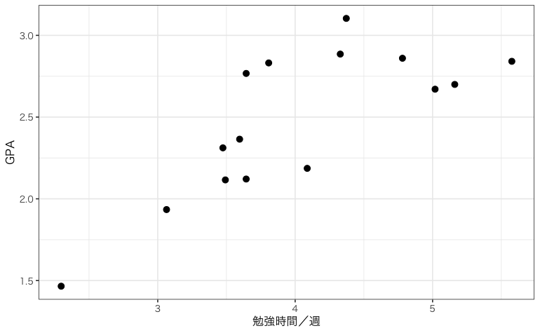
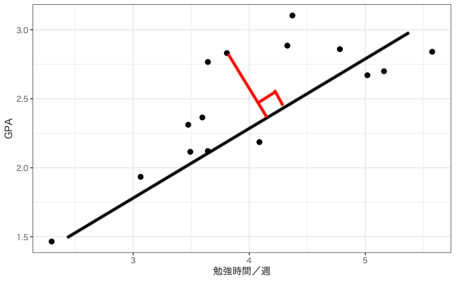
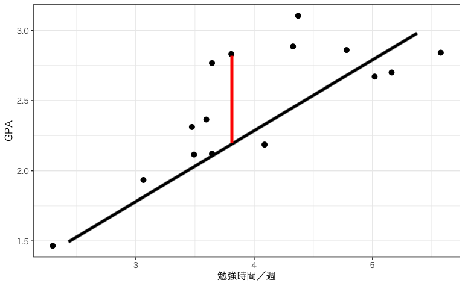

**締切：2026年10月23日24:00**

以下の文章を読み、続く問題に答えなさい。なお回答はWebClass上とする。

## 文章

いま、駒大生のGPAに週あたりの勉強時間がどのような影響を与えるのかを知りたいとしよう。この関係を二変数のモデルとして特定化すると【１】になる。このモデルの中で、回帰係数$\beta_{1}$は【２】として解釈できる。

ここで駒大生全体から15人をランダムサンプリングして、GPAと勉強時間のデータを収集した。データを散布図にすると以下の通りとなった。

この散布図からは【３】関係が見えるが、特定化したモデルを最小二乗法で推定してみよう。

最小二乗法では、予測値と観測値の差である「<u>【４】残差</u>」を全て二乗し、足し合わせた合計を最小化するような回帰係数$\hat{\beta_{1}}$と切片$\hat{\beta_{0}}$を求めることになる。

具体的には$\hat{\beta_{1}}$は【５】の式で計算される。

このような手続きで推定された回帰係数$\hat{\beta_{1}}$は0よりも【６】。

しかし、回帰係数$\hat{\beta_{1}}$は「<u>【７】ランダム性</u>」を有することに注意すべきである。

また、独立変数である勉強時間が内生性を持つ可能性、つまり誤差項と【８】可能性も考えられる。

いま誤差項に「本人の能力」という要因が含まれ、かつ勉強時間と正の相関関係にあるとしよう。

この時推定された回帰係数$\hat{\beta_{1}}$は、真の値よりも【９】に推定されている。

もし本人の能力と勉強時間に相関がなければ回帰係数$\hat{\beta_{1}}$は母集団における真の値$\beta_{1}$の不偏推定量となり、【１０】。

## 問題

問１：上の文章の【１】に当てはまるのは以下のどちらか。

1. $GPA_{i}=\beta_{0}+\beta_{1}勉強時間_{i}+\varepsilon_{i}$
2. $勉強時間_{i}=\beta_{0}+\beta_{1}GPA_{i}+\varepsilon_{i}$

問２：上の文章の【２】に当てはまるのは以下のうちどれか。

1. 週あたりの勉強時間が0時間だった時のGPAの値
2. GPAが1単位増えるときに勉強時間がどれだけ増えるか
3. 勉強時間が1時間増えるたびにGPAがどれだけ増えるか
4. 勉強時間以外にGPAに影響する要因すべて

問３：上の文章の【３】に当てはまるのは以下のどれか。

1. はっきりしない
2. 右肩上がりの
3. 右肩下がりの

問４：上の文章の「【４】残差」について、残差を表しているものとして正しいのは以下のグラフ上で表される赤線のうちどちらか。

1. （ある観察から回帰曲線に向かって垂直に下ろした線）
    
    
    
2. （ある観察から回帰曲線に向かってy軸と並行に下ろした線）
    
    
    
    

問５：上の文章の【５】に当てはまるのは以下のどれか。

1. $\hat{\beta_{1}}=\frac{1}{\sum(X_i-\bar{X})^2}$
2. $\hat{\beta_{1}}=\frac{\sum(X_i-\bar{X})(Y_i-\bar{Y})}{\sum(X_i-\bar{X})^2}$
3. $\hat{\beta_{1}}=\sum(X_i-\bar{X})(Y_i-\bar{Y})$
4. $\hat{\beta_{1}}=\frac{N}{\sum(X_i-\bar{X})^2}$

問６：上の文章の【６】に当てはまるのは以下のどちらか。

1. 大きい
2. 小さい

問７：上の文章の「【７】ランダム性」について正しい説明は以下のうちどちらか。

1. 同じデータでも最小二乗法で推定するたびに違う値が推定される
2. 同じ母集団からでも別の標本で最小二乗法を推定すると違う値が推定される

問８：上の文章の【８】に当てはまるのは次のうちどちらか。

1. まったく相関を持たない
2. 何らかの相関を持つ

問９：上の文章の【９】に当てはまるのは次のうちどちらか。

1. 大きく
2. 小さく

問１０：上の文章の【１０】に当てはまるのは次のうちどちらか。

1. $\beta_{1}$に完全に一致する
2. $\beta_{1}$を平均とする正規分布にしたがう