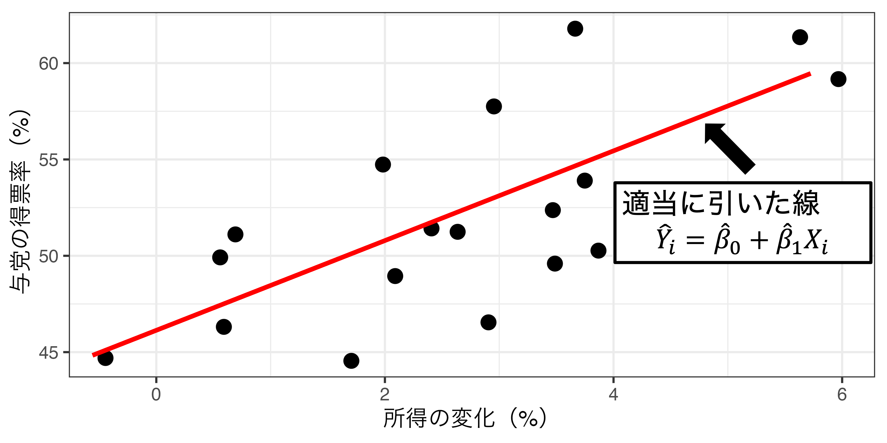
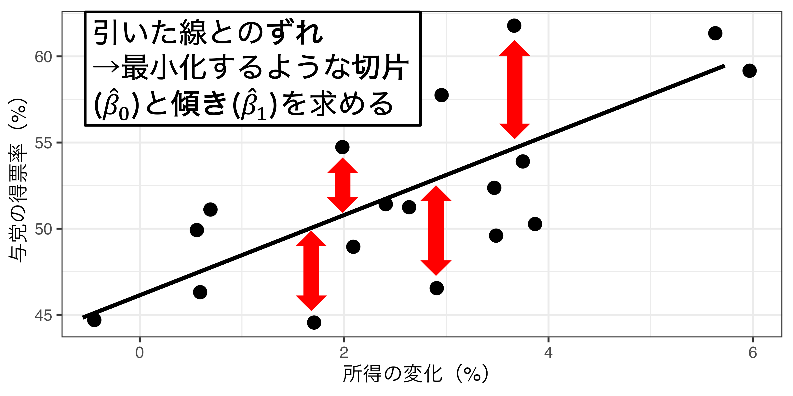
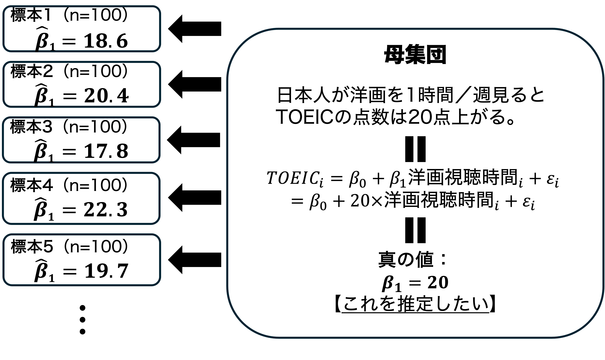
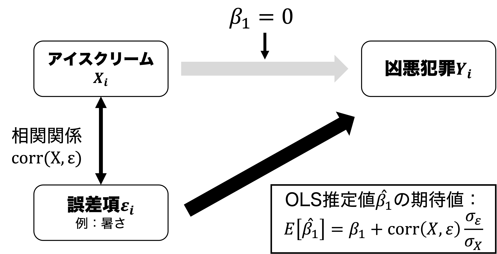



## 出席登録をお願いします


## 今日の目次

1. はじめに
1. 二変量回帰モデル
1. 最小二乗法
1. OLSのランダム性
1. OLSの不偏性
1. まとめ

# はじめに
## 本日の目的と到達目標 {.smaller}
#### 目的
回帰分析の最も基本的な形である二変量モデルを紹介する。基本となる統計モデルについて復習した後に、回帰分析によって回帰係数を推定し、その推定値を因果効果として解釈するための基本的な方法として、最小二乗法（OLS）を学ぶ。確率分布の基本を学んだ後、OLSで得られた因果効果の推定量のランダム性を議論する。さらに内生性が推定結果をどのように歪めるのかについても検討する。

::: {.fragment .fade-in}
#### 到達目標
1. 二変量回帰モデル（$Y_i=\beta_0+\beta_{1}X_{i}+\varepsilon_i$）の各項を説明できる。
1. 仮想的な散布図を使って最小二乗法による回帰係数の推定を説明できる。
1. 回帰係数の推定値$\hat{\beta_{1}}$の計算式を書き出し、その意味を説明できる。
1. 回帰係数の推定値$\hat{\beta_{1}}$がランダム性を持つのはなぜかを説明できる。
1. 回帰係数の推定値$\hat{\beta_{1}}$が不偏推定量であることの意味、そしてそれが成立する条件を説明できる。

:::

## 小テストの講評
TBD

# 二変量回帰モデル
## 例：アメリカ大統領選挙
```{r data-set}
#| include: false
load("data/Ch3_ChapterExample_Incumbent_vote.RData")
```

```{r}
dta |> 
  ggplot(aes(x = RDI, y = Vote100)) +
  geom_point(size = 3) +
  geom_label_repel(aes(label = Year)) +
  labs(x = "所得の変化（%）", y = "与党の得票率（%）")
```

## モデルの特定化
::: {.fragment .fade-in}
基本モデル
$$
Y_i=\beta_{0}+\beta_{1}X_i+\varepsilon_{i}
$$

:::

::: {.fragment .fade-in}
この例では…

$$
得票率_t=\beta_{0}+\beta_{1}所得の変化率_t+\varepsilon_{t}
$$

::: {.incremental}
- $\beta_{0}$：所得の変化率が0の時の与党の得票率
- $\beta_{1}$：所得の変化率が1単位増加したとき与党の得票率がどれくらい増えるか
<!-- - $\varepsilon_{t}$：所得の変化率以外に与党の得票率に影響する要因すべて -->

:::
:::

# 最小二乗法
## クイズ
以下の3つの線のうち、どれが一番いいと思いますか？それはなぜですか？

```{r OLS-quiz1}
#| layout-ncol: 3
#| fig-height: 5
#| fig-width: 3

dta |> 
  ggplot(aes(x = RDI, y = Vote100)) +
  geom_point(size = 3) +
  geom_abline(intercept = 50, slope = 0.5) +
  xlim(-1, 6.5)+
  labs(title = "(a)",
       x = "所得の変化（%）", 
       y = "与党の得票率（%）")

dta |> 
  ggplot(aes(x = RDI, y = Vote100)) +
  geom_point(size = 3) +
  geom_abline(intercept = 46.12, slope = 2.2) +
  xlim(-1, 6.5)+
  labs(title = "(b)",
       x = "所得の変化（%）", 
       y = "与党の得票率（%）")

dta |> 
  ggplot(aes(x = RDI, y = Vote100)) +
  geom_point(size = 3) +
  geom_abline(intercept = 35, slope = 10) +
  xlim(-1, 6.5)+
  labs(title = "(c)",
       x = "所得の変化（%）", 
       y = "与党の得票率（%）")

```


## 最小二乗法
#### Ordinary Least Square: OLS
```{r gen-scatter}
#| include: false
dta |> 
  ggplot(aes(x = RDI, y = Vote100)) +
  geom_point(size = 3) +
  labs(x = "所得の変化（%）", 
       y = "与党の得票率（%）")
```

::: {.r-stack}
{.fragment .center}

{.fragment .center}
:::

## OLSの手順
::: {.incremental}
- 予測値：$\hat{Y_i}=\hat{\beta_{0}}+\hat{\beta_{1}}X_i$
- 残差：$\hat{\varepsilon_{i}}=Y_{i}-\hat{Y_{i}}=Y_{i}-(\hat{\beta_{0}}+\hat{\beta_{1}}X_i)$
- 残差平方和：$\sum \hat{\varepsilon_{i}}^2=\sum \{Y_{i}-(\hat{\beta_{0}}+\hat{\beta_{1}}X_i)\}^2$
   - そのまま足すと0になるので二乗する
- 残差平方和を最小化する$\hat{\beta_{1}}$と$\hat{\beta_{0}}$を求める
   - 微分が必要なので求め方は割愛
   - $\hat{\beta_{1}}=\frac{\sum(X_i-\bar{X})(Y_i-\bar{Y})}{\sum(X_i-\bar{X})^2}$、$\hat{\beta_{0}}=\bar{Y}-\hat{\beta_{1}}\bar{X}$

:::

## 大統領選データでの計算 {.smaller}
::: {.fragment .fade-in}
::: {.columns}

::: {.column width=20%}
| 年     | $X_i$ | $Y_i$ | 
| ------ | ----- | ----- | 
| 1948   | 3.47  | 52.37 | 
| 1952   | 1.71  | 44.55 | 
| 1956   | 2.95  | 57.75 | 
| 1960   | 0.56  | 49.92 | 
| …     | …    | …    | 

- $\bar{X}=2.66$
- $\bar{Y}=51.98$

:::

::: {.column width=80%}
$$
\begin{aligned}
\hat{\beta_{1}}&=\frac{\sum(X_i-\bar{X})(Y_i-\bar{Y})}{\sum(X_i-\bar{X})^2}\\\\&=\frac{(3.47 - 2.66) (52.37 - 51.98) + (1.71 - 2.66) (45.55 - 51.98) + \cdots}{(3.47 - 2.66)^2 + (1.71 - 2.66)^2 + \cdots}\\\\&=2.22\\\
\hat{\beta_{0}}&=\bar{Y}-\hat{\beta_{1}}\bar{X}\\\\&=51.98-2.22\times2.66\\\\&=46.1
\end{aligned}
$$
:::
:::

:::


## クイズ
$\hat{\beta_{1}}$が正になるのは次のうちどのデータだと思いますか？
```{r OLS-quiz2}
#| layout-ncol: 3
#| fig-height: 5
#| fig-width: 3

N <- 50
scatter_dta <- tibble(
    x        = runif(N, min = 0, max = 1),
    y1       = 0.4 + 0.8 * x + rnorm(N, mean = 0, sd = 0.1),
    y2       = 0.4 - 0 * x   + rnorm(N, mean = 0, sd = 0.1),
    y3       = 0.8 - 0.8 * x + rnorm(N, mean = 0, sd = 0.1)
)

x_mean <- scatter_dta$x |> mean()
y1_mean <- scatter_dta$y1 |> mean()
y2_mean <- scatter_dta$y2 |> mean()
y3_mean <- scatter_dta$y3 |> mean()

scatter_dta |> 
  ggplot(aes(x = x, y = y1)) +
  geom_point(size = 3) +
  labs(title = "データ1",
       x = "X", 
       y = "Y")

scatter_dta |> 
  ggplot(aes(x = x, y = y2)) +
  geom_point(size = 3) +
  labs(title = "データ2",
       x = "X", 
       y = "Y")

scatter_dta |> 
  ggplot(aes(x = x, y = y3)) +
  geom_point(size = 3) +
  labs(title = "データ3",
       x = "X", 
       y = "Y")

```

## 推定値の意味
::: {.panel-tabset}
#### 右肩上がりの場合
```{r OLS-intpret1}
scatter_dta |> 
  ggplot(aes(x = x, y = y1)) +
  geom_point(size = 3) +
#  geom_smooth(method = "lm", se = FALSE) +
  geom_vline(xintercept = x_mean, linetype = 2) +
  geom_hline(yintercept = y1_mean, linetype = 2) +
  annotate("text", 
           x = x_mean,
           y = 0.45,
           label = "bar(X)",
           size = 8,
           parse = TRUE) +
  annotate("text", 
           x = 0.01,
           y = y1_mean,
           label = "bar(Y)",
           size = 8,
           parse = TRUE) +
  annotate("rect",
           xmin  = x_mean,
           xmax  = Inf,
           ymin  = y1_mean,
           ymax  = Inf,
           alpha = .1,
           fill  = "blue") +
    annotate("rect",
           xmin  = -Inf,
           xmax  = x_mean,
           ymin  = -Inf,
           ymax  = y1_mean,
           alpha = .1,
           fill  = "green") +
  labs(x = "X", 
       y = "Y")
```

#### 右肩下がりの場合
```{r OLS-intpret2}
scatter_dta |> 
  ggplot(aes(x = x, y = y3)) +
  geom_point(size = 3) +
#  geom_smooth(method = "lm", se = FALSE) +
  geom_vline(xintercept = x_mean, linetype = 2) +
  geom_hline(yintercept = y3_mean, linetype = 2) +
  annotate("text", 
           x = x_mean,
           y = 0.7,
           label = "bar(X)",
           size = 8,
           parse = TRUE) +
  annotate("text", 
           x = 0.01,
           y = y3_mean,
           label = "bar(Y)",
           size = 8,
           parse = TRUE) +
  annotate("rect",
           xmin  = x_mean,
           xmax  = Inf,
           ymin  = -Inf,
           ymax  = y3_mean,
           alpha = .1,
           fill  = "blue") +
    annotate("rect",
           xmin  = -Inf,
           xmax  = x_mean,
           ymin  = y3_mean,
           ymax  = Inf,
           alpha = .1,
           fill  = "green") +
  labs(x = "X", 
       y = "Y")
```

:::


::: {.notes}
右肩上がりの関係が成り立っている散布図

- 縦と横の点線がXとYそれぞれの平均値

右上（青い網掛け）

- X - bar(X)が正＝Xの平均よりも大きい
- Y - bar(Y)が正＝Yの平均よりも大きい
- 掛け合わせて正

左下（緑の網掛け）

- X - bar(X)が負＝Xの平均よりも小さい
- Y - bar(Y)が負＝Xの平均よりも小さい
- 掛け合わせて正

図の説明

- 散布図＋回帰直線
- 点線がXとYそれぞれの平均値
- 回帰直線XとYそれぞれの平均値を座標とする点を通る

右下（青い網掛け）

- X - bar(X)が正＝Xの平均よりも大きい
- Y - bar(Y)が負＝Yの平均よりも小さい
- 掛け合わせて負

左下（緑の網掛け）

- X - bar(X)が負＝Xの平均よりも小さい
- Y - bar(Y)が正＝Xの平均よりも大きい
- 掛け合わせて負

:::


# OLSのランダム性
## 確率変数
特定の確率で値が定まる変数

::: {.fragment .fade-in}
**確率分布**は確率変数が取る値の確率を定める

::: {.incremental}
- コイン投げ→分布：表1/2、裏1/2
- サイコロ→分布：各目が1/6
- 身長など多くの**連続変数**→**正規分布**

:::
:::

## 正規分布
```{r norm}
tibble(x = c(-3, 3)) |> 
  ggplot(aes(x = x)) +
  stat_function(fun = dnorm,
                n = 1000, 
                args = list(mean = 0, sd = 1)) +
  labs(x = "", y = "")
```

::: {.notes}
- 身長は**連続変数**＝任意の範囲でどんな値でも取りうる変数
- 連続変数の分布は確率密度関数=特定の範囲の面積が確率
:::

## OLS推定値のランダム性
OLS推定値$\hat{\beta_{1}}$はランダム性を持つ＝確率変数である

::: {.incremental}
- 正規分布にしたがう（後述）
:::

::: {.fragment .fade-in}
$\hat{\beta_{1}}$のランダム性の原因

::: {.incremental}
1. サンプリングによるランダム性
1. モデル化されたランダム性（割愛）

:::
:::

## サンプリングによるランダム性



<!-- ## モデル化されたランダム性 -->
<!-- 従属変数にそもそも**誤差項**が含まれていることによって$\hat{\beta_{1}}$はランダム性を持つ -->

<!-- ::: {.incremental} -->
<!-- - OLS推定値：$\hat{\beta_{1}}=\frac{\sum(X_i-\bar{X})(Y_i-\bar{Y})}{\sum(X_i-\bar{X})^2}$ -->
<!-- - 従属変数：$Y_i=\beta_0+\beta_{1}X_{i}+\varepsilon_i$ -->
<!-- - 誤差項$\varepsilon_i$はランダム＝確率変数 -->

<!-- ::: -->

<!-- ## OLSの正規性 -->
<!-- **中心極限定理**により観察数が十分であれば$\hat{\beta_{1}}$は正規分布に従う -->

<!-- ```{r norm-OLS} -->
<!-- tibble(x = c(-3, 3)) |>  -->
<!--   ggplot(aes(x = x)) + -->
<!--   stat_function(fun = dnorm, -->
<!--                 n = 1000,  -->
<!--                 args = list(mean = 0, sd = 1)) + -->
<!--   scale_x_continuous(breaks = c(-3, 0, 3), -->
<!--                      labels = c("", expression(beta[1]), "")) + -->
<!--   labs(x = "", y = "") -->
<!-- ``` -->

# OLSの不偏性
## OLSの不偏性
$X$と$\varepsilon$が無相関のとき（＝内生性がないとき）、$\hat{\beta}_{1}$は真の値$\beta_{1}$の**不偏推定量**である。

::: {.incremental}
```{r norm-OLS}
tibble(x = c(-3, 3)) |> 
  ggplot(aes(x = x)) +
  stat_function(fun = dnorm,
                n = 1000, 
                args = list(mean = 0, sd = 1)) +
  scale_x_continuous(breaks = c(-3, 0, 3),
                     labels = c("", expression(beta[1]), "")) +
  labs(x = "", y = "")
```

:::

## OLSのバイアス
$X$と$\varepsilon$に相関があるとき（＝内生性があるとき）、$\hat{\beta}_{1}$には**バイアス**（偏り）が生じる

::: {.fragment .fade-in}
$\hat{\beta_{1}}$の期待値：$E[\hat{\beta_{1}}]=\beta_{1}+\text{corr}(X, \varepsilon)\frac{\sigma_{\varepsilon}}{\sigma_{X}}$

::: {.incremental}
- 第2項$\text{corr}(X, \varepsilon)\frac{\sigma_{\varepsilon}}{\sigma_{X}}$が**バイアス**
     - $\text{corr}(X, \varepsilon)$：$X$と$\varepsilon$との相関
- バイアスのパターン
     - $\text{corr}(X, \varepsilon)>0$（正の相関）→$\beta_{1}$が**過大推定**
     - $\text{corr}(X, \varepsilon)<0$（負の相関）→$\beta_{1}$が**過小推定**
     - $\text{corr}(X, \varepsilon)=0$（無相関）→$\beta_{1}$は**正確に推定**（＝バイアスなし）
     

:::
:::

::: {.notes}
期待値の導出：

- $\hat{\beta_{1}}=\frac{\sum(X_i-\bar{X})(Y_i-\bar{Y})}{\sum(X_i-\bar{X})^2}$に$Y_i=\beta_0+\beta_{1}X_{i}+\varepsilon_i$を代入すると求められる（割愛）
:::

## 例：凶悪犯罪とアイスクリームの売上

{.r-stretch}

Q. 暑いほどアイスクリームが売れる時、OLS推定値$\hat{\beta}_{1}$は真値$\beta_{1}=0$よりも大きくなる？それとも小さくなる？

# まとめ
## 本日の目的と到達目標 {.smaller}
#### 目的
回帰分析の最も基本的な形である二変量モデルを紹介する。基本となる統計モデルについて復習した後に、回帰分析によって回帰係数を推定し、その推定値を因果効果として解釈するための基本的な方法として、最小二乗法（OLS）を学ぶ。確率分布の基本を学んだ後、OLSで得られた因果効果の推定量のランダム性を議論する。さらに内生性が推定結果をどのように歪めるのかについても検討する。

::: {.fragment .fade-in}
#### 到達目標
1. 二変量回帰モデル（$Y_i=\beta_0+\beta_{1}X_{i}+\varepsilon_i$）の各項を説明できる。
1. 仮想的な散布図を使って最小二乗法による回帰係数の推定を説明できる。
1. 回帰係数の推定値$\hat{\beta_{1}}$の計算式を書き出し、その意味を説明できる。
1. 回帰係数の推定値$\hat{\beta_{1}}$がランダム性を持つのはなぜかを説明できる。
1. 回帰係数の推定値$\hat{\beta_{1}}$が不偏推定量であることの意味、そしてそれが成立する条件を説明できる。

:::

## 次回までに

::: {.fragment .fade-in}
#### 事後学習

 - 授業資料を見直し、目標到達をセルフチェック
 - WebClass上での確認小テスト（金曜日まで）
 - 【任意】[OLS推定値の導出の学習ビデオ（YouTube）](https://www.youtube.com/watch?v=Zz1sgYxrA-k)を視聴する。

:::

::: {.fragment .fade-in}
#### 事前学習

 - 教科書（第3章3.4-3.6: pp.86-98）を読む
 
:::
```{r assignment}
#| include: false
N <- 15

GPA_dta <- tibble(
  study = rnorm(N, mean = 4, sd = 1),
  GPA = 0.5 + 0.5 * study + rnorm(N, mean = 0, sd = 0.25)
)

GPA_dta |> 
  ggplot(aes(x = study, y = GPA)) +
  geom_point(size = 2.5) +
  # geom_smooth(method = "lm",
  #             se = FALSE,
  #             colour = "red") +
  labs(x = "勉強時間／週", y = "GPA")

```


