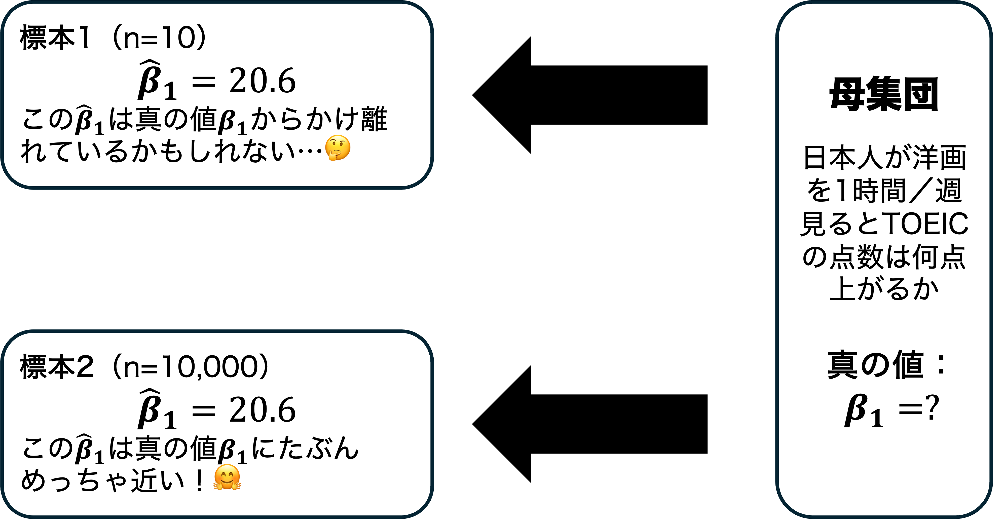



## 出席登録をお願いします


## 今日の目次

1. はじめに
1. 復習：OLSの基本
1. OLS推定の精度
1. OLSの一致性
1. 不均一分散と誤差の相関
1. まとめ

# はじめに
## 本日の目的と到達目標 {.smaller}
#### 目的
二変量回帰モデルについて深掘りする。標準誤差の概念を導入し、OLS推定の精度に影響する要因を議論する。その中でも特にサンプルサイズに焦点を当て、OLS推定値がもつ「一致性」という性質を紹介する。さらに、通常の標準誤差が適用できない条件として不均一分散や誤差同士の相関という問題についても議論する。

::: {.fragment .fade-in}
#### 到達目標
1. 回帰係数の推定値$\hat{\beta_{1}}$の分散の標準式を識別できる。
1. 回帰係数の推定値$\hat{\beta_{1}}$の分散の式を使い、分散に影響を与える3つの要因を列挙できる。
1. 回帰係数の推定値$\hat{\beta_{1}}$が持つ一致性という性質を説明できる。
1. 回帰係数の推定値$\hat{\beta_{1}}$の分散の標準式が使えない状況3つを説明できる。

:::

## 小テストの講評
TBD

# 復習：OLSの基本
## 最小二乗法
#### Ordinary Least Square: OLS
::: {.r-stack}
{.fragment .center}

{.fragment .center}
:::

## OLS推定値の計算式
**傾き$\beta_{1}$：**

$$
\hat{\beta_{1}}=\frac{\sum(X_i-\bar{X})(Y_i-\bar{Y})}{\sum(X_i-\bar{X})^2}
$$

**切片$\beta_{0}$：**

$$
\hat{\beta_{0}}=\bar{Y}-\hat{\beta_{1}}\bar{X}
$$

## サンプリングによるランダム性


## OLS推定値の分布
$X$と$\varepsilon$が無相関のとき（＝内生性がないとき）、$\hat{\beta}_{1}$は真の値$\beta_{1}$を**期待値**（平均）とする**正規分布**にしたがう。

::: {.incremental}
```{r norm-OLS}
tibble(x = c(-3, 3)) |> 
  ggplot(aes(x = x)) +
  stat_function(fun = dnorm,
                n = 1000, 
                args = list(mean = 0, sd = 1)) +
  scale_x_continuous(breaks = c(-3, 0, 3),
                     labels = c("",
                                bquote(beta[1] == 20),
                                "")) +
  labs(x = "", y = "")
```

:::

# OLS推定の精度
## 質問
どちらが真値を正確に推定しているでしょうか？

```{r}
tibble(x = c(-3, 3)) |> 
  ggplot(aes(x = x)) +
  stat_function(fun = dnorm,
                n = 1000, 
                args = list(mean = 0, sd = 1),
                aes(linetype = "A.広い正規分布")) +
    stat_function(fun = dnorm,
                n = 1000, 
                args = list(mean = 0, sd = 0.3),
                aes(linetype = "B.狭い正規分布")) + scale_x_continuous(breaks = c(-3, 0, 3),
                     labels = c("",
                                bquote(beta[1] == 20),
                                "")) +
  labs(x = "", y = "", linetype = "") +
  theme(legend.position = "bottom")
```

## OLS推定値の精度
#### 分散 (variance)
確率変数の**ばらつき**を表す尺度

::: {.incremental}
- **広い**正規分布：分散が**大きい**→平均からかけ離れた値が**出やすい**
- **狭い**正規分布：分散が**小さい**→平均からかけ離れた値が**出にくい**

:::

::: {.fragment .fade-in}
#### 標準誤差 (standard error)
OLSで推定した切片および傾きの分散の**平方根**

::: {.incremental}
- 標準偏差との区別に注意
- 平方根を取ることで、独立変数と単位が揃う

:::
:::

::: {.fragment .fade-in}
**→分散／標準誤差が小さいほど推定は正確**

:::

## OLS推定値の分散
**ある一定の条件を満たした場合**の$\hat{\beta_{1}}$の分散は以下の式で計算。

::: {.fragment .fade-in}
$$
\text{var}(\hat{\beta_{1}})=\frac{\hat{\sigma}^2}{N\times\text{var}(X)}
$$
:::

::: {.fragment .fade-in}
分散に影響する3つの要因：

::: {.incremental}
- $\hat{\sigma}^2$：**回帰分散**
- $N$：**サンプルサイズ**
- $\text{var}(X)$：**独立変数（$X$）の分散**

:::
:::

## 回帰分散
モデルがどれだけ$Y$のばらつきを説明しているか

::: {.fragment .fade-in}
$$
\hat{\sigma}^2=\frac{\sum(Y_i-\hat{Y}_i)^2}{N-k}=\frac{\sum\hat{\varepsilon}_i^2}{N-k}
$$

:::

::: {.incremental}
- 分母（$N - k$）：サンプルサイズから変数の数（$k$）を引いたもの（自由度）
- 分子（$\sum(Y_i-\hat{Y}_i)^2=\sum\hat{\varepsilon}_i^2$）：**残差平方和**

:::

::: {.fragment .fade-in}
→残差平方和が小さければ回帰分散も小さく、$\text{var}(\hat{\beta_{1}})$も小さい（＝推定精度が上がる）

:::

---

```{r regvar}
#| layout-ncol: 2
#| fig-height: 2
#| fig-width: 2

N <- 100
x <- runif(N, min = 4, max = 14)
x_centered <- x - mean(x) # 中心化

# --- 回帰式が「完全に一致」するデータを生成する関数 ---
make_exact_lm_data <- function(x, slope = 3, intercept = 0, sd = 1) {
  # 誤差の初期値
  e <- rnorm(length(x), mean = 0, sd = sd)
  # Xと直交する残差ベクトルを作成（傾きを理論値に固定するため）
  e_perp <- e - (sum(e * x_centered) / sum(x_centered^2)) * x_centered
  e_final <- e_perp - mean(e_perp) # 切片を理論値に固定するため
  
  # Yの生成
  y <- intercept + slope * x + e_final
  return(tibble(x = x, y = y))
}

scatter_regvar1 <- make_exact_lm_data(x, sd = 1.5)
scatter_regvar2 <- make_exact_lm_data(x, sd = 6)

y_min <- min(scatter_regvar1$y) - 2
y_max <- max(scatter_regvar2$y) + 2

scatter_regvar1 |> 
  ggplot(aes(x = x, y = y)) +
  geom_point() +
  geom_smooth(method = "lm", se = FALSE) +
  xlim(4, 14) + ylim(y_min, y_max) +
  labs(title = "回帰分散：小",
       x = "独立変数（X）",
       y = "従属変数（Y）")

scatter_regvar2 |> 
  ggplot(aes(x = x, y = y)) +
  geom_point() +
  geom_smooth(method = "lm", se = FALSE) +
  xlim(4, 14) + ylim(y_min, y_max) +
  labs(title = "回帰分散：大",
       x = "独立変数（X）",
       y = "従属変数（Y）")
```


## クイズ
以下の2つのグラフでは$\hat{\beta_{1}}$の分散はどちらが小さいでしょうか

::: {.panel-tabset}
#### クイズ①
```{r quiz1}
#| layout-ncol: 2
#| fig-height: 2
#| fig-width: 2
scatter_a <- tibble(
  x = runif(10, min = 4, max = 14),
  y = 3 * x   + rnorm(10, mean = 0, sd = 3)
)

scatter_b <- tibble(
  x = runif(10, min = 7, max = 11),
  y = 3 * x   + rnorm(10, mean = 0, sd = 3)
)


scatter_a |> 
  ggplot(aes(x = x, y = y)) +
  geom_point() +
  xlim(4, 14) + ylim(14, 40) +
  labs(title = "グラフ（a）",
       x = "独立変数（X）",
       y = "従属変数（Y）")

scatter_b |> 
  ggplot(aes(x = x, y = y)) +
  geom_point() +
  xlim(4, 14) + ylim(14, 40) +
  labs(title = "グラフ（b）",
       x = "独立変数（X）",
       y = "従属変数（Y）")
```

#### クイズ②
```{r quiz2}
#| layout-ncol: 2
#| fig-height: 2
#| fig-width: 2
scatter_c <- tibble(
  x = runif(10, min = 4, max = 14),
  y = 3 * x   + rnorm(10, mean = 0, sd = 3)
)

scatter_d <- tibble(
  x = runif(50, min = 4, max = 14),
  y = 3 * x   + rnorm(50, mean = 0, sd = 3)
)


scatter_c |> 
  ggplot(aes(x = x, y = y)) +
  geom_point() +
  xlim(4, 14) + ylim(14, 40) +
  labs(title = "グラフ（c）",
       x = "独立変数（X）",
       y = "従属変数（Y）")

scatter_d |> 
  ggplot(aes(x = x, y = y)) +
  geom_point() +
  xlim(4, 14) + ylim(14, 40) +
  labs(title = "グラフ（d）",
       x = "独立変数（X）",
       y = "従属変数（Y）")
```

:::


# OLSの一致性
## 質問
他の条件が同じなら、$N$が無限大に近づいていくにつれて$\text{var}(\hat{\beta_{1}})=\frac{\hat{\sigma}^2}{N\times\text{var}(X)}$の値はどうなっていくと思いますか。


## OLS推定値の一致性
サンプルサイズ（$N$）が大きくなるにつれて、OLS推定値$\hat{\beta_{1}}$は真値$\beta_{1}$に確率的に収束（$\text{plim}\hat{\beta}_1=\beta_1$）

::: {.r-stack}

::: {.fragment}
```{r}
tibble(x = c(-3, 3)) |> 
  ggplot(aes(x = x)) +
  stat_function(fun = dnorm,
                n = 100, 
                args = list(mean = 0, sd = 1)) +
  scale_x_continuous(breaks = c(-3, 0, 3),
                     labels = c("",
                                bquote(beta[1] == 20),
                                "")) +
  scale_y_continuous(limits = c(0, 2), labels = NULL) +
  labs(title = "N = 100",  x = "", y = "")
```

:::

::: {.fragment}
```{r}
tibble(x = c(-3, 3)) |> 
  ggplot(aes(x = x)) +
  stat_function(fun = dnorm,
                n = 100, 
                args = list(mean = 0, sd = 0.5)) +
  scale_x_continuous(breaks = c(-3, 0, 3),
                     labels = c("",
                                bquote(beta[1] == 20),
                                "")) +
  scale_y_continuous(limits = c(0, 2), labels = NULL) +
  labs(title = "N = 1000",  x = "", y = "")
```

:::

::: {.fragment}
```{r}
tibble(x = c(-3, 3)) |> 
  ggplot(aes(x = x)) +
  stat_function(fun = dnorm,
                n = 100, 
                args = list(mean = 0, sd = 0.25)) +
  scale_x_continuous(breaks = c(-3, 0, 3),
                     labels = c("",
                                bquote(beta[1] == 20),
                                "")) +
  scale_y_continuous(limits = c(0, 2), labels = NULL) +
  labs(title = "N = 10000",  x = "", y = "")
```

:::

:::

## 一致性の意味
{.r-strech}

# 不均一分散と誤差の相関
## OLS推定値の分散
**ある一定の条件を満たした場合**の$\hat{\beta_{1}}$の分散は以下の式で計算。

::: {.fragment .fade-in}
$$
\text{var}(\hat{\beta_{1}})=\frac{\hat{\sigma}^2}{N\times\text{var}(X)}
$$
:::

::: {.fragment .fade-in}
以下の場合ではこの計算式は使えない。

::: {.incremental}
- **不均一分散**…誤差項$\varepsilon_i$の分散が全ての観測で同じにならない
- **誤差項同士の相関**…誤差項$\varepsilon_i$が観察同士で相関
   - **クラスター化された誤差**
   - **自己相関**

:::
:::

::: {.fragment}
ただし以上の場合でも係数にバイアスは生じるとは限らない
:::

## 不均一分散
誤差項$\varepsilon_i$が観察同士で相関

::: {.incremental}
- 例：年齢と年収

:::

::: {.fragment .fade-in}
```{r}
#| layout-ncol: 2
#| fig-height: 2
#| fig-width: 2

scatter_hetero <- tibble(
  x = runif(100, min = 0, max = 20),
  y_homo   = 5 * x   + rnorm(100, mean = 0, sd = 10),
  y_hetero = 5 * x   + 0.3 * x * rnorm(100, mean = 0, sd = 10)
)

scatter_hetero |> 
  ggplot(aes(x = x, y = y_homo)) +
  geom_point() +
  scale_x_continuous(labels = NULL) +
  scale_y_continuous(labels = NULL) +
  labs(title = "均一分散",
       x = "独立変数（X）",
       y = "従属変数（Y）")

scatter_hetero |> 
  ggplot(aes(x = x, y = y_hetero)) +
  geom_point() +
  scale_x_continuous(labels = NULL) +
  scale_y_continuous(labels = NULL) +
  labs(title = "不均一分散",
       x = "独立変数（X）",
       y = "従属変数（Y）")
```
:::


## 誤差項同士の相関
誤差項$\varepsilon_i$が観察同士で相関

::: {.incremental}
- **クラスター化された誤差**…観察がグループ化されている場合
   - 例：学校ごとのテストの点数
      - 名門校のAさんBさんCさん→地頭という誤差項が全員高い
- 時系列データの**自己相関**…前の年の誤差が次の年にも影響
   - 例：経済成長
      - 技術革新という誤差項→昨年も高ければ今年も高い

:::

# まとめ
## 本日の目的と到達目標 {.smaller}
#### 目的
二変量回帰モデルについて深掘りする。標準誤差の概念を導入し、OLS推定の精度に影響する要因を議論する。その中でも特にサンプルサイズに焦点を当て、OLS推定値がもつ「一致性」という性質を紹介する。さらに、通常の標準誤差が適用できない条件として不均一分散や誤差同士の相関という問題についても議論する。

::: {.fragment .fade-in}
#### 到達目標
1. 回帰係数の推定値$\hat{\beta_{1}}$の分散の標準式を識別できる。
1. 回帰係数の推定値$\hat{\beta_{1}}$の分散の式を使い、分散に影響を与える3つの要因を列挙できる。
1. 回帰係数の推定値$\hat{\beta_{1}}$が持つ一致性という性質を説明できる。
1. 回帰係数の推定値$\hat{\beta_{1}}$の分散の標準式が使えない状況3つを説明できる。

:::

## 次回までに

::: {.fragment .fade-in}
#### 事後学習

 - 授業資料を見直し、目標到達をセルフチェック
 - WebClass上での確認小テスト（金曜日まで）

:::

::: {.fragment .fade-in}
#### 事前学習

 - 教科書（第3章3.7-3.8および結論: pp.86-98）を読む
 
:::
